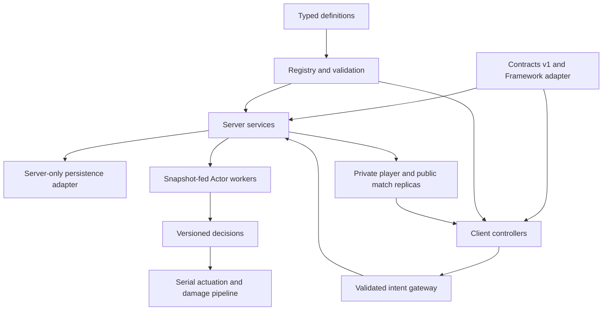

# Architecture plan

Status: proposal, not implemented. Source: brief §§4–8, 11. Read [contracts](CONTRACTS.md), [decisions](DECISIONS.md), [catalog](CONTENT-CATALOG.md), and [backlog](PTG-TODO-List.md) together.

## Existing foundation and migration

The existing Rojo project maps top-level Configs/Controllers into ReplicatedStorage and Services into ServerScriptService. Boot files currently print greetings; the WeatherService/WeatherController examples are not wired by those boots. Retain their files until Phase 0 inventories their intended use and migrates or isolates them without duplication. WeatherController currently expects Atmosphere/Sky and weather child modules; do not assume these exist. Its dynamic-light creation needs scope/deduplication review before reuse.

Aftman and Knit remain the baseline. Retain ProfileService behind a persistence adapter unless the owner approves a verified replacement. Current `Lighting.Technology` is `Voxel` in the project; modern lighting, streaming and character settings require a documented place-settings decision rather than silently changing the scaffold. Keep generated packages and sourcemap separate from authored code.

## Layers and boot order

Proposed boot: establish logger/scopes → load framework/package adapters → register contracts/remotes → load and validate definitions/assets → create Interface + Stub or real service bindings → resolve dependency graph → initialize services → start replication/listeners → start GameLoop. Client boot waits with bounded readiness checks for schemas/replicas, then binds controllers/input. A fatal config/contract error prevents gameplay startup with an actionable log; optional effect failure must not stop the round.

Factories and lifecycle hooks support stub substitution without gameplay imports. Construction uses interfaces and injection; typed signals convey facts across systems. Pure modules cannot require Roblox services. Separate Roblox-value config adaptation from Lune schema/reference validation.

## Match and player lifecycle

| State | Duration / behavior | Exit |
|---|---|---|
| Idle | Empty server; no live round resources | First eligible join → Intermission |
| Intermission | 15 s; previous round teardown, caches/locks reset | Timer → Voting |
| Voting | 15 s; 3 weighted candidates without replacement; sticky pad votes | Timer → Loading |
| Loading | 10 s; uniform tie-break, clone/validate map, roll scenario/events | Ready → Teleport; failure → safe recovery |
| Teleport | Active players only; snapshot and lock loadout; grant server tools | Completion → PreRound |
| PreRound | 10 s; announce scenario/countdown | Timer → Active |
| Active | 240 s normal; boss deadline 240 s (owner-confirmed D-01/D-02) | Timer, all dead, or all bosses defeated |
| Resolution | Cancel spawn/events; resolve exactly once | Outcome-specific routing |
| Results | 10 s; lobby return, survivors and three MVPs, reward facts | Intermission |

Normal expiry staggers droid explosions, stops events and pays survivors once. Everyone dead shows No Survivors then skips Results to Intermission. All required bosses dead before deadline stops the timer, waits 10 s and celebrates before Results. Any required boss alive at deadline explodes surviving players; no survival reward. Two-boss scenarios track both identities, even if the same placeholder definition is instantiated twice. Payment ownership stays with B; A emits one immutable RoundOutcome with a settlement key.

AFK is evaluated on the server at teleport, not inferred from a client's UI toggle. Late joins/rejoins stay in lobby/spectate. Leave removes player from participant/vote/lock/target lists. Death returns the player to the lobby and spectate. Empty server invalidates current round and cancels pending delayed work. Per-state watchdogs recover safely; loading/teleport failures must never leave permanent locks or tools.

Player and Character scopes differ. Bind existing/future characters, validate Humanoid/root/Animator, recheck generation after yields, and clear effects/tracks/tools when that character is removed. Resolve current references at request time.

## Registry and extension model

Auto-discover `src/shared/Config/<Domain>/<Id>.luau` definitions. Validate all fields, IDs, positive weights, referenced strategies/assets and dialogue links before freezing public data. Global tuning lives in `Game.luau`; perf/network limits in `Perf.luau`/network config; strings in a localization-ready shared module. Server behavior implementations/hooks remain server-only; shared definitions reference BehaviorId/AbilityId instead of exposing arbitrary functions to clients.

Data-only extension means reuse a registered strategy/subtree/hook. A brand-new mechanic may need a new strategy, but must not require editing the round loop or central registry dispatch. Recipes explicitly state this boundary. New schema fields require the contract workflow after freeze.

The source's explicit Map.DroidPool needs a declarative extension rule to satisfy the new-droid-file-only requirement. R-20 proposes optional EligibleMapIds on a new DroidDefinition; registry unions opt-ins with each map's original explicit pool, validates and deduplicates. Original content does not opt into additional maps. Phase 0 reviews this field before freeze, then J proves actual spawning from one added definition plus rig.

## Combat and item transaction boundaries

DamageService is the sole damage authority: base damage → dealt/taken/class/armour/buff modifiers → immunity/faction checks → HP/contribution ledger → one death fact → economy settlement. Clamp credited overkill to actual HP lost; proposed handling is tracked as R-02 pending specification. FastCast simulates guns on server; client tracers are cosmetic. Melee queries are server-side. Ammo, cooldown, reload and modifier math are pure modules with injected time.

Loadout editing/purchasing is allowed only in Lobby. Server tool grants come only from the immutable round snapshot; no lobby tool activation. Backpack/Character monitors reconcile unauthorized tools and remove grants on exit. Client InputController maps actions across devices; server validates the resulting intent independently.

Reward routing distinguishes ordinary and boss deaths (owner-confirmed D-05). Non-boss droids retain the source KillerOnly formula, including the killer's truncated damage ratio; contributors still supply assist/MVP facts. Boss-event rewards share contribution proportionally across eligible contributors using the same authoritative ledger. The precise eligibility, rounding and remainder rules are proposed in [decisions](DECISIONS.md); B settles once using the death/event settlement identity. A boss definition cannot select the ordinary payout policy accidentally.

Walk-speed changes use a source-tagged composition policy (D-26): proposed v0.1 behavior takes the strongest active positive multiplier instead of multiplying buffs, then clamps final speed to 32 studs/s against an assumed base 16. Numeric tuning remains proposed pending balance/device tests. Removing the strongest source recomputes from the remaining sources; expiry, death and round teardown restore the appropriate base rather than a stale cached speed. Keep damage/HP multiplier policies separate; this nerf does not change their composition.

Purchases use a serialized per-profile transaction: validate latest state/ownership/funds/cap → reserve mutation → grant/update durable data → confirm persistence according to adapter policy → publish replica. Roll back safely on failure and never acknowledge unconfirmed durable receipt grants. Utility use consumes one persisted inventory unit and reserves use/cooldown under the same transaction; failed placement must have a defined refund path. External DataStore/network work must not occur in a yielding UpdateAsync callback.

## Persistence and monetization

Use session-locked profile adapter with schema versions, reconcile, migrations, autosave, leave release and bounded shutdown flush. Failed load is not a new profile: disable mutating actions and never save defaults over existing data. Store only serializable data. Private replication excludes receipt history and internal transaction metadata.

One ProcessReceipt dispatcher routes known products. Product IDs of zero are guarded; unknown/unavailable profiles return NotProcessedYet. Persist grant/entitlement and receipt identity before PurchaseGranted. A retry, disconnect or shutdown must not duplicate inventory, coins, donation totals, spin credit or pick tokens. Bounded receipt-history compaction needs a safe durable replay strategy; it is a release gate, not permission to forget replayable receipts.

Wheel outcome is committed server-side before cosmetic presentation. Free spin eligibility uses persisted remaining connected-playtime, initially 900 seconds (D-13). A monotonic server clock deducts only a player's connected time, including lobby/AFK time; offline time never advances it. Serialize timer/spin mutations with profile transactions, save the remaining duration on autosave/leave/shutdown, and resume that remainder on rejoin. A missing/unloaded profile cannot advance or spend eligibility. The zero boundary produces one ready free entitlement rather than queued spins; after a free spin, the next 900-second period starts. Paid receipts grant separate durable pending spin credits and do not reset the free timer. Wall-clock timestamps such as NextFreeSpinAt cannot determine free eligibility.

Gems are deferred entirely (owner-confirmed D-18): no profile/replica fields, UI, purchase, reward or receipt grants. The historical wheel gem entry is disabled. Preserving the remaining relative weights and normalizing over total 92 is a proposal documented in D-18, not a new prize or silently accepted economy change. Validate that the active wheel contains no gem handler before enabling it.

Pick Tokens queue map + scenario intents, FIFO one per round during Intermission/Voting; cancellations and eligibility checks must preserve entitlement. Four OrderedDataStore boards use throttled writes, cached Top 50 reads, name caching and retry/backoff. Gamepass ownership queries are cached and fallible; never derive product grants from a purchase-completed UI callback. Chair/sofa purchases and the obby are outside agent implementation scope (D-17); the owner designs them, and commerce must not depend on their presence.

Levels use a linear progression (owner-confirmed D-21). Proposed tuning is 100 total XP per level: Level = 1 + floor(TotalXP / 100); the next threshold is Level * 100. Proposed ordinary droid base XP is 0.2 * BaseHP, yielding 20/20/10/20/60/30/24 XP for the seven catalog droids. The boss has an explicit proposed 100 base-XP override; HP times 50 does not imply XP times 50. Neutral-map pools are therefore 175 XP for Big Boss Droid and 300 XP per It's Over boss before boosts, shared proportionally. Retain source reward multipliers/boosts and the coin formula; these XP numbers are candidates for pacing tests, not owner-approved final economy values. Persist total XP, derive level through one pure calculator, and test exact boundaries, multi-level grants, boss sharing, boosts and nonfinite/negative inputs.

## Droid AI and events

Each droid has its own BT/blackboard/lifecycle; a fixed configurable Actor pool processes batches. Main thread publishes immutable per-frame/versioned target snapshots. Workers score targets and decide actions; serial host checks round/entity/generation freshness before MoveTo, damage, effects or animations. No shared mutable Instance state in worker logic. Verify engine thread-safety for each proposed call; line-of-sight queries can be budgeted serial inputs when needed. Pathfinding uses cached, bounded serial work unless verified otherwise.

Scheduler uses near/mid/far tick rates, phase offsets and an AI ms/frame budget, with direct chase on clear line-of-sight and path reuse/stuck recovery otherwise. Independent 10 s respawn timers avoid repeating last spawn; when fewer than two valid spawns exist, MapValidator rejects the template. Recovery occurs above engine kill height. Droids/projectiles are pooled, with full reset of HP, modifiers, blackboard, signals and ownership. Allied factions reuse target filters; turrets are targetable structures.

Events have Start/Tick/Stop and scoped cleanup. Tornado is the only implemented event/disaster (owner-confirmed D-16), and spawns Wind droids with BulletImmune. Do not add named event/disaster stubs to satisfy counts. For the existing scenarios requiring two or three event/disaster slots, the proposed selection policy instantiates scoped Tornado instances with distinct EventInstanceIds; retain source scenario counts, distinguish instance count from distinct definition count, and share one aggregate Wind/debris/performance budget. Repeat selection is a proposal pending validation, not a silent reduction of scenario requirements.

The boss reuses the Regular Droid's rig, brain, attack and existing movement/abilities with HP multiplied by 50 (100 * 50 = 5000) and a bigger body. Uniform scale 2 is proposed pending collision/pathing/attack tests. No new phases, attacks, abilities or player-count HP scaling are introduced. E owns boss definition/policy and emits outcomes; D retains the underlying Regular behavior and A applies the 240-second deadline. One or two bosses have distinct runtime IDs, and both must die in the two-boss scenario. Boss rig scaling must also feed validated pathing clearance and attack origins. Destruction affects tagged eligible pieces, with collision groups, debris lifetime/cap and frame-staggered mass explosions. Re-cloning restores a map.

## Cleanup, reliability and budgets

Ownership chain: server → player → character; server → round → map/entities/events/projectiles/statuses. Pools/Actor workers can be persistent server resources with a warmed baseline; each round clears their jobs/assignments. No delayed callback may apply after its RoundId/generation expires. Stop methods are idempotent.

Define measured budgets in Perf config during J's baseline task. Required target: 60 FPS on documented low-end mobile. Proposed budget fields include ServerFrameMs, AiMsPerFrame, path queries/frame, ActorCount, effect/debris caps, pooled instance counts and cleanup drain time. Numeric budgets are provisional until measured; a desktop emulator does not prove mobile performance.

Logger uses levels/tags/ring buffer and aggregate rejection counts. Metrics include round timing, cap/alive count, AI average/p95 ms, Actor load, instances/connections/tasks and persistence/receipt failures. ErrorBoundary isolates recoverable tasks; watchdog escalates repeat failure to safe teardown. Debug allowlist and production disable switches are mandatory.

## Integration sequence

Phase 0 / M1: scaffold, adapter, all interfaces/stubs, validation and stub loop. M2: live combat and seven droids with server security. M3: durable economy, receipts, wheel, boards, dialogue and client plumbing. M4: scenarios, Tornado, bosses/destruction and all item abilities. M5: full device/failure/security/perf/20-round soak and config-only extension demonstrations. The backlog contains exact task dependencies and gate evidence.
