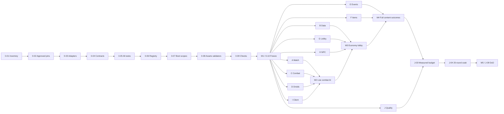

# Play This Game — complete v0.1 task plan

Baseline: 2026-10-07. Source: `D:\13Games\PLAY_THIS_GAME_BRIEF.md`, v0.1 Foundation Build. Planning documentation is approved. **Coding authorized 2026-10-08. The owner has authorized gameplay task agents before formal M1 completion; contracts remain unfrozen.** Root [AGENTS.md](../AGENTS.md) governs work; [index](README.md) links all supporting plans.

## Implementation checkpoint (2026-10-08)

Latest owner exception: proceed with task-specific implementation agents, fix draft contracts, omit evidence-file updates, and do not rerun unit suites. WS-A-01 through WS-A-07 and the Match portion of WS-I have source implementations in `match.project.json`: loop, voting, map/scenario catalogs, player state, teleport, pure results, primitive lobby, and HUD. MCP now reaches the owner's Studio workspace. Root repaired the foundation harness's native return checks and integrated the reviewed voting, loop-restart, Studio identity and strict-type fixes. The Match preview starts in Play, all three map templates load/unload, and all five scenario plans resolve. They remain In progress pending combat/droids/events/data, two-client and full-catalog integration. See root README for the current development selector and checks; historical evidence files are unchanged.

A-to-B continuation (2026-10-08): A source hardening and interface orchestration are integrated; Studio preview confirmed two-boss celebration/results and immediate map/lobby cleanup. A-08 still requires real B/C/D/E/G, full catalog/multiplayer acceptance and prepared test execution. B-01 through07 now have source implementations; B-08 injected Studio checks cover transactions/shop/inventory/boosts/projections/reward retries/load recovery. Real persistence, real ReplicaService networking, upstream reward context/retry integration and journal compaction remain pending. Source implementation alone does not check off acceptance. See root README, ADR-007 and TASK-THREADS for the handoff.

Root owns the serial foundation. Groups01/03 completed read-only source reviews; Group02 supplied initial contract recommendations but its dependency audit established no new pins. Root integrated the verified fixes. Implemented: 29 typed Interface/Stub pairs, draft payloads/enums, Knit adapter and Studio-only boot, cleanup scopes, pure registry/RNG/config validation primitives, primitive map validation and fixture factory, and a local check pipeline. The [evidence log](evidence/PHASE-0-START.md) records exact checks and omissions.

WS-0-01 through WS-0-09 have partial foundation artifacts and remain In progress. None is checked as complete. WS-0-04/05 now include 13 canonical request schemas, minimal match/private projection validation, injected snapshot subscriptions and a prepared public Studio client fixture. WS-0-08 includes recovery-anchor/malformed-spawn rejection and an explicit harness pass/fail marker. WS-0-09 passes 50 pure tests plus 29 static shell checks. WS-0-10 is Pending M1: full signal/replica/domain schema coverage, content discovery, durable transaction/reward/Actor shapes, mandated adapters/package audit and observed Studio server/client evidence are required before freeze. Domain implementation in groups 01/02/03 is queued behind that gate. No live persistence, receipts, combat or economy is enabled by the stubs.

## Scope and tracking

Deliver the complete server-authoritative loop with primitive assets, every catalog item and reusable data-driven strategies. Final art, model/UI design, audio and dialogue authoring remain owner work. See [catalog](CONTENT-CATALOG.md) for exact numbers and [contracts](CONTRACTS.md) for proposed interfaces.

Owner clarification update: 2026-10-07. The nine clarified decisions supersede the brief's earlier assumptions: round and boss deadline are both 240 seconds; regular droid rewards go to the killer, boss rewards share one contribution pool; free-spin remaining time persists and only runs while connected; only Tornado is implemented and the boss reuses Regular Droid with HP ×50 and larger size; chair/sofa/obby and Gems are deferred; leveling is linear; speed stacking is nerfed. Concrete tuning below is explicitly proposed, not measured or approved final balance. [Task threads](TASK-THREADS.md) records the owner's requested group review subthreads.

Proposed compatibility rules preserve all five scenarios without inventing additional event types: select repeat Tornado instances with unique runtime IDs for the required event/disaster counts, share aggregate Wind/debris/force budgets and teardown each instance independently. It's Over uses two distinct runtime instances of the same Regular-derived boss. This selection rule and uniform boss scale 2 remain proposals. The approved boss HP is 100 × 50 = 5000; its movement, damage and brain match Regular Droid, with no phases, extra attacks or player-count HP scaling.

Proposed balance fixtures: linear `Level = 1 + floor(totalXP / 100)`; ordinary `Droid.XP = 0.2 × base HP` gives Regular20, Chaser20, Range10, Wind20, Noob60, Worker30 and Police24. `BossDefinition.XP = 100` is a separate override, not derived from enlarged boss HP. Five full-credit Regular kills yield one level before configured multipliers; each boss XP pool starts at100 before source modifiers and is shared, never100 per contributor. Neutral BigBoss×1.75 yields175XP total; each It's Over boss×3 yields300XP total before personal/map boosts. Simulate map/scenario kill rates and then playtest before treating this as final balance. Proposed movement rule is `WalkSpeed = min(baseWalkSpeed × max(1, activeSpeedFactors), 32)` for the baseline16 fixture; sources never multiply together. Ghost3, Booster2 and Cola2 therefore resolve to32 together; removing Ghost leaves32 while either ×2 source remains and removing all restores16. Other non-speed stat layers retain their separate rules.

Gem deferral disables the source's +5 Gems / 8% wheel entry. Keep that entry reserved in documentation only: no Gem schema, replica, grant, shop or UI code. The other seven source weights total92; interpreting each as `weight / 92` is a proposed temporary draw policy, not owner-approved final probabilities. Do not silently redistribute the removed8% or claim the original eight prizes remain operational.

There are **84 implementation tasks**, all initially unchecked. IDs are stable. S = approximately one focused session; M = a few sessions; L = multiple sessions and integration. Sizes are relative, not delivery promises. P0 = required foundation/security/core/release gate; P1 = required supporting feature; P2 = optional enhancement only. P1 still belongs in v0.1; optional scaffolders/analytics/site generation are not release blockers.

Parallel Y means independent implementation may proceed against frozen interfaces/stubs after the Phase 0 gate and within reserved files. It never means bypassing dependency approvals or that a live demo can pass against a stub. Parallel N means serial foundation/integration/gate work. Each task owns domain tests in addition to the listed production files; J maintains shared harnesses. After work is authorized, record assignee/reservations and blockers here. Do not check tasks merely because their plan is written.

## Phases and milestone gates

| Phase | Purpose | Exit |
|---|---|---|
| 0 | Serial foundation, package audit, contracts, per-service stubs, validators, primitive fixtures and verified commands | M1 / WS-0-10; no gameplay code before this gate |
| 1 | A–I domain implementation with continuous J quality, isolated ownership and interface substitution | Domain unit tests and reviewable real implementations |
| 2 | Incremental integration M2 → M3 → M4; real services replace stubs with security/perf/failure checks | Full catalog and every outcome functional |
| 3 | Measured budgets, ≥20-round soak, extension proof, final review/evidence | M5 / WS-J-09; release readiness, not publishing authorization |

| Milestone | Required tasks / prerequisites | Demonstration and acceptance |
|---|---|---|
| M1 — loop with stubs | WS-0-01…WS-0-10 | Validated primitive map and full stub loop in Studio; frozen Contracts v1; all local gates pass |
| M2 — combat + droids | M1; WS-A-01…07; WS-C-01…08; WS-D-01…08; WS-I-01…02 | Sticky voting/teleport, loadout lock, melee/guns, 7 droids and death/spectate facts; caps/ownership/AI and two-client abuse evidence |
| M3 — economy + lobby | M2; WS-B-01…08; WS-G-01…08; WS-H-01…04; WS-I-03…05 | Rejoin/shutdown persistence, shop/caps/boosts, wheel/receipts/picks/4 boards/donations, 4 NPC stubs; zero-ID guarded placeholders |
| M4 — events/bosses/items | M3; WS-E-01…07; WS-F-01…08; WS-A-08; WS-I-06 | All 5scenarios/3 maps/7 droids/9 gears/4 utilities/3 armours/3 classes; Tornado, 2 boss outcome, destruction, all-device primitive client flow |
| M5 — hardening | M4; WS-J-01…09 | Security, failure recovery, measured performance, 20-round leak assertions, recipe proofs and complete DoD/evidence |

M2 may exercise a smaller live selection while remaining content is being implemented, but it cannot claim the full v0.1 catalog before M4. M3's known product plumbing may be demonstrated with mocks/guarded IDs; live Marketplace verification is reported separately and cannot be invented.

## Dependency graph and critical path



Critical dependency chain: WS-0-01 → 02 → 03 → 04 → 05 → 06 → 07 → 08 → 09 → 10, then combat/parallel-AI foundation → real event/boss integration (WS-E-07) → complete match (WS-A-08) and item integration (WS-F-08) → performance WS-J-03 → soak WS-J-04 → final gate WS-J-09. Data/transaction/receipt work is a co-critical lane into M3 and the soak. Exact wall-clock critical path cannot be calculated from S/M/L sizes; recompute when estimates and assignees exist.

Frozen interfaces remove development-time blockers: E/F can implement against D/C stubs and G/H against B stubs. Live integration still depends on real services. The graph shows milestone ordering; the task dependencies below are the executable DAG. Milestone progression also requires all preceding milestone evidence, even where no real-code dependency exists.

## Phase 0 — serial foundation

### Workstream 0 — Phase 0 — serial foundation

#### WS-0-01

- [ ] **Inventory and preserve the scaffold**

Inspect Rojo mappings, weather examples, generated packages and current user changes; record migration plan without deleting them.

- **Inputs / outputs (contracts):** In: existing scaffold; out: ownership inventory/ADR-001.
- **Dependencies:** None.
- **Owned files:** `root configs; docs/ARCHITECTURE.md; docs/DECISIONS.md`; `tests/unit/foundation/*` and `tests/integration/foundation/*` as applicable. J coordinates only its reserved harness/test paths.
- **Acceptance:** All current mapped subtrees and missing boot/weather dependencies recorded; no unrelated edits. Relevant tests plus format/lint/type checks pass; record unavailable engine/hardware checks separately.
- **Size:** S · **Priority:** P0 · **Parallelizable:** N · **Status:** In progress (root; partial foundation artifacts, see evidence log).

#### WS-0-02

- [ ] **Verify and pin the toolchain/packages**

Audit upstream/Wally availability, maintenance, licenses/transitives and CLI compatibility; record choices and obtain required dependency approvals during implementation.

- **Inputs / outputs (contracts):** In: current pins; out: ADR-002/003, approved manifests and tool configs.
- **Dependencies:** WS-0-01.
- **Owned files:** `aftman.toml; wally.toml; wally.lock; stylua.toml; selene.toml; .luaurc; .gitignore`; `tests/unit/foundation/*` and `tests/integration/foundation/*` as applicable. J coordinates only its reserved harness/test paths.
- **Acceptance:** No guessed versions; approved pins resolve; manifests/locks tracked deliberately; formatter/linter/type/test tools installed only after authorization. Relevant tests plus format/lint/type checks pass; record unavailable engine/hardware checks separately.
- **Size:** L · **Priority:** P0 · **Parallelizable:** N · **Status:** In progress (root; partial foundation artifacts, see evidence log).

#### WS-0-03

- [ ] **Create framework and package adapters**

Wrap Knit, persistence, replica and projectile packages; expose dependencies through injection/locator without business imports of packages.

- **Inputs / outputs (contracts):** In: approved packages; out: Framework, persistence/replica/cast boundaries.
- **Dependencies:** WS-0-02.
- **Owned files:** `src/shared/Framework/*; src/server/Infrastructure/Adapters/*`; `tests/unit/foundation/*` and `tests/integration/foundation/*` as applicable. J coordinates only its reserved harness/test paths.
- **Acceptance:** Adapters strict-type-check; fake bindings swap with no service API change; no cyclic requires. Relevant tests plus format/lint/type checks pass; record unavailable engine/hardware checks separately.
- **Size:** M · **Priority:** P0 · **Parallelizable:** N · **Status:** In progress (root; partial foundation artifacts, see evidence log).

#### WS-0-04

- [ ] **Define and review Contracts v1**

Translate draft catalog into public types, enums, remotes, signal and replica schemas; resolve contract-impacting R-02/04/07/11/18/19/20 interpretations before freeze, including definition-owned droid eligibility for one-file extension.

- **Inputs / outputs (contracts):** In: draft CONTRACTS/catalog/ADRs; out: typed contract candidates.
- **Dependencies:** WS-0-03.
- **Owned files:** `src/shared/Types/*; src/shared/Contracts/*; docs/CONTRACTS.md; docs/DECISIONS.md`; `tests/unit/foundation/*` and `tests/integration/foundation/*` as applicable. J coordinates only its reserved harness/test paths.
- **Acceptance:** Every domain/service/intent/fact/replica covered; finite/bounds/error rules and ownership explicit; unresolved balance marked, approved semantics recorded. Relevant tests plus format/lint/type checks pass; record unavailable engine/hardware checks separately.
- **Size:** L · **Priority:** P0 · **Parallelizable:** N · **Status:** In progress (root; partial foundation artifacts, see evidence log).

#### WS-0-05

- [ ] **Provide every Interface and Stub**

Create lifecycle-safe service shells and fake client/replica bindings, including internal teleport/boss services; exclude owner-deferred chair/sofa/obby and Gem APIs; safe no-live-data startup.

- **Inputs / outputs (contracts):** In: contract candidates; out: injectable Interface + Stub manifest.
- **Dependencies:** WS-0-04.
- **Owned files:** `src/server/Services/*/{Interface,Stub}.luau; src/client/Boot/*; src/server/Boot/*`; `tests/unit/foundation/*` and `tests/integration/foundation/*` as applicable. J coordinates only its reserved harness/test paths.
- **Acceptance:** Every catalog service has a compiling stub; deterministic startup/stop; no payment acknowledgement/live writes in test stubs. Relevant tests plus format/lint/type checks pass; record unavailable engine/hardware checks separately.
- **Size:** L · **Priority:** P0 · **Parallelizable:** N · **Status:** In progress (root; partial foundation artifacts, see evidence log).

#### WS-0-06

- [ ] **Build discovery, config validation and pure utilities**

Create single registry, schema/reference checks, seeded WeightedRandom and clock interfaces; freeze approved definitions.

- **Inputs / outputs (contracts):** In: domain schemas; out: Registry, ConfigValidator, RNG/clock and Game/Perf skeletons.
- **Dependencies:** WS-0-05.
- **Owned files:** `src/shared/Registry/*; src/shared/Util/{WeightedRandom,Clock}.luau; src/shared/Config/{Game,Perf}.luau; tests/unit/foundation/*`; `tests/unit/foundation/*` and `tests/integration/foundation/*` as applicable. J coordinates only its reserved harness/test paths.
- **Acceptance:** Unknown references/duplicates/nonpositive weights fail actionably; definitions discover automatically; pure logic works without Roblox services. Relevant tests plus format/lint/type checks pass; record unavailable engine/hardware checks separately.
- **Size:** L · **Priority:** P0 · **Parallelizable:** N · **Status:** In progress (root; partial foundation artifacts, see evidence log).

#### WS-0-07

- [ ] **Establish boot, scopes and observability**

Wire adapter services, server/player/character/round/entity ownership, Logger/Metrics/ErrorBoundary; plan safe migration of existing weather examples.

- **Inputs / outputs (contracts):** In: interfaces/registry; out: working boot/lifecycle and scoped timers.
- **Dependencies:** WS-0-06.
- **Owned files:** `src/{server,client}/init.*.luau; src/server/Infrastructure/*; default.project.json; docs/DECISIONS.md`; `tests/unit/foundation/*` and `tests/integration/foundation/*` as applicable. J coordinates only its reserved harness/test paths.
- **Acceptance:** Boot has no duplicate registrations; every resource gets owner; teardown twice is safe; isolated failure does not kill boot/loop. Relevant tests plus format/lint/type checks pass; record unavailable engine/hardware checks separately.
- **Size:** L · **Priority:** P0 · **Parallelizable:** N · **Status:** In progress (root; partial foundation artifacts, see evidence log).

#### WS-0-08

- [ ] **Implement asset validator and primitive fixtures**

Codify proposed map/droid/gear/NPC contracts; choose place settings, rig support and Rojo mappings after review; create primitive maps/spawns only.

- **Inputs / outputs (contracts):** In: MODEL_CONTRACT; out: validators/templates, ADR-005.
- **Dependencies:** WS-0-07.
- **Owned files:** `assets/* foundation fixtures; src/shared/Contracts/Assets/*; src/server/Services/Match/MapValidator.luau; tests/fixtures/assets/*; default.project.json`; `tests/unit/foundation/*` and `tests/integration/foundation/*` as applicable. J coordinates only its reserved harness/test paths.
- **Acceptance:** Three maps pass; missing root/spawn/attachment/unsafe positions fail with paths; at least two droid spawns; no themed models/UI. Relevant tests plus format/lint/type checks pass; record unavailable engine/hardware checks separately.
- **Size:** L · **Priority:** P0 · **Parallelizable:** N · **Status:** In progress (root; partial foundation artifacts, see evidence log).

#### WS-0-09

- [ ] **Wire local checks and stub loop tests**

Implement verified Lune runners, pure config adapters, Studio stub harness, formatting/lint/type/build scripts and documentation of exact commands.

- **Inputs / outputs (contracts):** In: boot/stubs/validators; out: local-runnable check pipeline and optional workflow file.
- **Dependencies:** WS-0-08.
- **Owned files:** `tools/{test-unit,test-integration,validate-config,check}.luau; tests/{unit,integration}/foundation/*; .github/workflows/check.yml; README.md`; `tests/unit/foundation/*` and `tests/integration/foundation/*` as applicable. J coordinates only its reserved harness/test paths.
- **Acceptance:** All documented commands run from root and propagate failures; sourcemap/type definitions work; mocked tests distinguished from Studio tests; workflow not pushed. Relevant tests plus format/lint/type checks pass; record unavailable engine/hardware checks separately.
- **Size:** L · **Priority:** P0 · **Parallelizable:** N · **Status:** In progress (root; partial foundation artifacts, see evidence log).

#### WS-0-10

- [ ] **Pass foundation gate and freeze Contracts v1**

Demonstrate stub Lobby→Vote→Map→Round→Results→Lobby in Studio; record schema version and release parallel ownership reservations.

- **Inputs / outputs (contracts):** In: all Phase 0 artifacts; out: M1 evidence/frozen Contracts v1.
- **Dependencies:** WS-0-09.
- **Owned files:** `docs/CONTRACTS.md; docs/DECISIONS.md; docs/PTG-TODO-List.md; docs/evidence/M1.md (future)`; `tests/unit/foundation/*` and `tests/integration/foundation/*` as applicable. J coordinates only its reserved harness/test paths.
- **Acceptance:** Build/format/lint/types/tests/config checks pass; Studio server/client Output and stub-loop evidence captured; freeze/approval record exists. Relevant tests plus format/lint/type checks pass; record unavailable engine/hardware checks separately.
- **Size:** M · **Priority:** P0 · **Parallelizable:** N · **Status:** Pending M1; contracts remain v0/unfrozen and Studio evidence is unavailable.

## Phase 1 — workstream implementation

### Workstream A — Match & Flow

#### WS-A-01

- [ ] **Implement round FSM and resolution arbitration**

Build legal transitions, injected timers and single settlement decision; define simultaneous boss/deadline/death ordering.

- **Inputs / outputs (contracts):** In: RoundContext/state enums; out: GameLoopService, RoundOutcome.
- **Dependencies:** WS-0-10.
- **Owned files:** `src/server/Services/Match/{GameLoopService,RoundStateMachine}.luau`; `tests/unit/match/*` and `tests/integration/match/*` as applicable. J coordinates only its reserved harness/test paths.
- **Acceptance:** Exact 15/15/10/10/240/10 timing; boss deadline240/celebration10; shared round/deadline boundary resolves once; stale callbacks and duplicate outcome rejected. Relevant tests plus format/lint/type checks pass; record unavailable engine/hardware checks separately.
- **Size:** L · **Priority:** P0 · **Parallelizable:** Y · **Status:** In progress.

#### WS-A-02

- [ ] **Implement sticky weighted voting**

Draw three maps without replacement, server pad occupancy ledger, replacement votes and uniform tie-break.

- **Inputs / outputs (contracts):** In: MapDefinition/RNG; out: VotingService/VoteChanged.
- **Dependencies:** WS-0-10.
- **Owned files:** `src/server/Services/Match/VotingService.luau; assets/Lobby/Match/VotePads/*`; `tests/unit/match/*` and `tests/integration/match/*` as applicable. J coordinates only its reserved harness/test paths.
- **Acceptance:** Leaving pad retains vote; switching replaces; departure clears; no duplicate choices; seeded/tie fixtures pass. Relevant tests plus format/lint/type checks pass; record unavailable engine/hardware checks separately.
- **Size:** M · **Priority:** P0 · **Parallelizable:** Y · **Status:** In progress.

#### WS-A-03

- [ ] **Load and validate three map definitions**

Populate Baseplate/House/Town data, spawn pools and primitive clones; abort invalid map cleanly and restore by clone.

- **Inputs / outputs (contracts):** In: MapContext/asset contract; out: MapService/MapReady.
- **Dependencies:** WS-0-10.
- **Owned files:** `src/server/Services/Match/MapService.luau; src/shared/Config/Maps/*; assets/Maps/*`; `tests/unit/match/*` and `tests/integration/match/*` as applicable. J coordinates only its reserved harness/test paths.
- **Acceptance:** Exact map multipliers/pools; clone→validate→unload passes each template; no old map survives failure/teardown. Relevant tests plus format/lint/type checks pass; record unavailable engine/hardware checks separately.
- **Size:** M · **Priority:** P0 · **Parallelizable:** Y · **Status:** In progress.

#### WS-A-04

- [ ] **Manage player state, AFK and safe teleport**

Bind current/future characters, evaluate AFK server-side at teleport, stagger movement, lobby death/spectate and join/leave rules.

- **Inputs / outputs (contracts):** In: PlayerData/Loadout interfaces; out: PlayerStateService, internal TeleportService, AliveList.
- **Dependencies:** WS-0-10.
- **Owned files:** `src/server/Services/Match/{PlayerStateService,TeleportService}.luau; assets/Lobby/Match/AFKZone/*`; `tests/unit/match/*` and `tests/integration/match/*` as applicable. J coordinates only its reserved harness/test paths.
- **Acceptance:** AFK excluded; late joins/rejoins lobby-only; leave cleans lists; stale character/yield cannot teleport replacement; zero eligible participants safe. Relevant tests plus format/lint/type checks pass; record unavailable engine/hardware checks separately.
- **Size:** L · **Priority:** P0 · **Parallelizable:** Y · **Status:** In progress.

#### WS-A-05

- [ ] **Populate scenario selection**

Implement exact five weights and event/disaster/boss counts using injected RNG; consume pick selection via interface. Use only Tornado definitions: repeated scoped instances and shared aggregate caps are the proposed compatibility policy (D-16), not additional disaster stubs.

- **Inputs / outputs (contracts):** In: ScenarioDefinition/Event/Boss IDs; out: ScenarioPlan.
- **Dependencies:** WS-0-10.
- **Owned files:** `src/server/Services/Match/ScenarioDirector.luau; src/shared/Config/Scenarios/*`; `tests/unit/match/*` and `tests/integration/match/*` as applicable. J coordinates only its reserved harness/test paths.
- **Acceptance:** Weights50/35/10/4/1 and multipliers match catalog; required counts retained through the explicitly proposed repeat-Tornado policy; each selected instance has a distinct identity and aggregate budget; no impossible selections silently reduced; reproducible seeded plan. Relevant tests plus format/lint/type checks pass; record unavailable engine/hardware checks separately.
- **Size:** M · **Priority:** P0 · **Parallelizable:** Y · **Status:** In progress.

#### WS-A-06

- [ ] **Implement all outcomes and results/MVP**

Track survivors and separate kills/damage/assist leaders; apply boss/all-dead/timer policy and publish one settlement.

- **Inputs / outputs (contracts):** In: DamageFacts/BossProgress; out: RoundOutcome/Results replica.
- **Dependencies:** WS-A-01, WS-A-04, WS-A-05.
- **Owned files:** `src/server/Services/Match/{RoundResolution,ResultsCalculator}.luau`; `tests/unit/match/*` and `tests/integration/match/*` as applicable. J coordinates only its reserved harness/test paths.
- **Acceptance:** All-dead skips Results; It's Over requires two runtime instances of one boss definition; deadline240 loses all alive; simultaneous round/deadline/death settled once; survivors at celebration end; rewards emitted exactly once. Relevant tests plus format/lint/type checks pass; record unavailable engine/hardware checks separately.
- **Size:** L · **Priority:** P0 · **Parallelizable:** Y · **Status:** In progress.

#### WS-A-07

- [ ] **Harden teardown, watchdog and empty server**

Cancel spawn/events/scoped jobs; clear participant locks and caches; recover stuck/loading/teleport failures.

- **Inputs / outputs (contracts):** In: scoped service Stop hooks; out: robust GameLoop teardown.
- **Dependencies:** WS-A-01, WS-A-03, WS-A-04, WS-A-06.
- **Owned files:** `src/server/Services/Match/{RoundCleanup,StateWatchdog}.luau`; `tests/unit/match/*` and `tests/integration/match/*` as applicable. J coordinates only its reserved harness/test paths.
- **Acceptance:** Abort any state, empty server and shutdown return safe Idle/lobby with no residual round ownership. Relevant tests plus format/lint/type checks pass; record unavailable engine/hardware checks separately.
- **Size:** M · **Priority:** P0 · **Parallelizable:** Y · **Status:** In progress.

### Workstream B — Data & Economy

#### WS-B-01

- [ ] **Implement session-locked profile adapter**

Wrap selected approved ProfileService/Store with load, session loss, release and no-default-save failure behavior.

- **Inputs / outputs (contracts):** In: persistence boundary; out: DataService.
- **Dependencies:** WS-0-10.
- **Owned files:** `src/server/Services/Data/{DataService,ProfileAdapter}.luau`; `tests/unit/data/*` and `tests/integration/data/*` as applicable. J coordinates only its reserved harness/test paths.
- **Acceptance:** Failed load blocks writes, session conflict cannot overwrite, release on leave and bounded BindToClose flush verified. Relevant tests plus format/lint/type checks pass; record unavailable engine/hardware checks separately.
- **Size:** L · **Priority:** P0 · **Parallelizable:** Y · **Status:** In progress.

#### WS-B-02

- [ ] **Create profile template and migrations**

Cover every active required field with reconcile/version pipeline and owner-tunable defaults; future-version handling. Persist remaining free-spin cooldown seconds, not an offline-running timestamp; omit Gems entirely. Rejoining resumes remaining cooldown and preserves linear total XP.

- **Inputs / outputs (contracts):** In: persistent schema; out: ProfileTemplate/Migrations.
- **Dependencies:** WS-0-10.
- **Owned files:** `src/server/Services/Data/ProfileTemplate.luau; src/server/Services/Data/Migrations/*`; `tests/unit/data/*` and `tests/integration/data/*` as applicable. J coordinates only its reserved harness/test paths.
- **Acceptance:** Migration repeated safely; serialization valid; active ownership/count fields reconcile without erasing prior data; no Gem field; remaining free-spin time survives leave/rejoin and never decrements offline. Relevant tests plus format/lint/type checks pass; record unavailable engine/hardware checks separately.
- **Size:** M · **Priority:** P0 · **Parallelizable:** Y · **Status:** In progress.

#### WS-B-03

- [ ] **Publish private and global replicas**

Wrap ReplicaService; expose minimal PlayerData/Match/Board snapshots and versioned deltas.

- **Inputs / outputs (contracts):** In: replica schemas/DataService; out: ReplicaPublisher.
- **Dependencies:** WS-B-01, WS-B-02.
- **Owned files:** `src/server/Services/Data/ReplicaPublisher.luau`; `tests/unit/data/*` and `tests/integration/data/*` as applicable. J coordinates only its reserved harness/test paths.
- **Acceptance:** Owner-only data targeted; session/receipt details absent; no Gem field/display; remaining free-spin cooldown shown from authoritative connected-session progress; late join/rejoin snapshot and removal work; no alternate authority. Relevant tests plus format/lint/type checks pass; record unavailable engine/hardware checks separately.
- **Size:** M · **Priority:** P0 · **Parallelizable:** Y · **Status:** In progress.


#### WS-B-04

- [ ] **Implement exact rewards and XP/level math**

Pure RewardCalculator: non-boss `KillerOnly` retains source killerDamageRatio scaling; boss `ProportionalAllContributors` divides one reward pool by actual damage shares, excluding overkill. Assist facts remain available for MVP. Resolve boost inheritance/quantization and disconnected-contributor payout policy via ADR. Use a configurable linear XP threshold; proposed100XP per level and HP-derived enemy XP are balancing fixtures linked to D-21, requiring simulation/playtest evidence.

- **Inputs / outputs (contracts):** In: DamageLedger/RoundOutcome/catalog; out: RewardCalculator/EconomyService.
- **Dependencies:** WS-0-10.
- **Owned files:** `src/shared/Util/Economy/{RewardCalculator,XpCurve}.luau; src/server/Services/Data/EconomyService.luau`; `tests/unit/data/*` and `tests/integration/data/*` as applicable. J coordinates only its reserved harness/test paths.
- **Acceptance:** Non-boss reward only to killer with source ratio (59.78% truncates to0.59; sole1.00). Boss shares keep full precision until explicit settlement quantization; actual-damage shares exclude overkill and no full pool is duplicated per player; disconnected policy documented; neutral SumBonus1; catalog map/scenario boosts; duplicate settlement rejected; no silent KillCoins rewrite. Linear fixtures100XP/level and Regular20/Chaser20/Range10/Wind20/Noob60/Worker30/Police24/boss100 override pass level-boundary and pacing simulations; neutral BigBoss pool175XP and each It's Over boss pool300XP before personal/map boosts; fixture numbers remain proposed. Relevant tests plus format/lint/type checks pass; record unavailable engine/hardware checks separately.
- **Size:** L · **Priority:** P0 · **Parallelizable:** Y · **Status:** In progress.

#### WS-B-05

- [ ] **Create serialized durable transactions and boosts**

Expose transaction reservation, mutation, save/confirmation and rollback; expiry/stacking policies injected/configured.

- **Inputs / outputs (contracts):** In: DataService/InventoryTransactions; out: transaction engine/BoostService.
- **Dependencies:** WS-B-01, WS-B-02.
- **Owned files:** `src/server/Services/Data/{TransactionEngine,BoostService}.luau`; `tests/unit/data/*` and `tests/integration/data/*` as applicable. J coordinates only its reserved harness/test paths.
- **Acceptance:** Concurrent balance operations serialize; failed save/leave cannot double grant; profile readiness rechecked; boost persistence/expiry correct. Relevant tests plus format/lint/type checks pass; record unavailable engine/hardware checks separately.
- **Size:** L · **Priority:** P0 · **Parallelizable:** Y · **Status:** In progress.

#### WS-B-06

- [ ] **Implement shop/inventory and lobby guards**

Data-generated purchasing for unique and consumable items; validate→deduct→grant→persist with cap and rollback.

- **Inputs / outputs (contracts):** In: registry/EconomyTransactions/PlayerState; out: ShopService.
- **Dependencies:** WS-B-04, WS-B-05.
- **Owned files:** `src/server/Services/Data/{ShopService,InventoryService}.luau`; `tests/unit/data/*` and `tests/integration/data/*` as applicable. J coordinates only its reserved harness/test paths.
- **Acceptance:** Cap100; buy at cap blocked; repeat unique purchase rejected; wheel/admin-only gear denied; wrong state and state-change-during-yield denied. Relevant tests plus format/lint/type checks pass; record unavailable engine/hardware checks separately.
- **Size:** L · **Priority:** P0 · **Parallelizable:** Y · **Status:** In progress.

#### WS-B-07

- [ ] **Add autosave, retry and failure recovery**

Budget/retry/backoff, shutdown deadline, metrics and session loss policy; avoid competing save paths.

- **Inputs / outputs (contracts):** In: persistence/transactions; out: reliable lifecycle.
- **Dependencies:** WS-B-01, WS-B-05.
- **Owned files:** `src/server/Services/Data/{SaveScheduler,PersistenceRecovery}.luau`; `tests/unit/data/*` and `tests/integration/data/*` as applicable. J coordinates only its reserved harness/test paths.
- **Acceptance:** DataStore errors bounded and surfaced; shutdown respects time budget; no unbounded retries/yielding UpdateAsync callbacks; no default overwrite. Relevant tests plus format/lint/type checks pass; record unavailable engine/hardware checks separately.
- **Size:** M · **Priority:** P0 · **Parallelizable:** Y · **Status:** In progress.

### Workstream C — Combat Core

#### WS-C-01

- [ ] **Implement single damage pipeline and contribution ledger**

Resolve damage/traits/faction/actual HP loss, one death fact and source attribution.

- **Inputs / outputs (contracts):** In: Damage/Stat contracts; out: DamageService/DamageLedger.
- **Dependencies:** WS-0-10.
- **Owned files:** `src/server/Services/Combat/DamageService.luau; src/shared/Util/Combat/DamageLedger.luau`; `tests/unit/combat/*` and `tests/integration/combat/*` as applicable. J coordinates only its reserved harness/test paths.
- **Acceptance:** No client damage authority; BulletImmune rejects bullets; duplicate deaths/overkill cannot inflate rewards; assists retained. Relevant tests plus format/lint/type checks pass; record unavailable engine/hardware checks separately.
- **Size:** L · **Priority:** P0 · **Parallelizable:** Y · **Status:** Not started.

#### WS-C-02

- [ ] **Implement stat and status stacks**

Pure modifier layers with source removal; proposed strongest-active-factor movement rule and server cap32studs/s from baseline16 (D-26), stun/ragdoll/knockback and current-character cleanup. Speed sources never multiply together; non-speed stat composition remains separately defined.

- **Inputs / outputs (contracts):** In: Stat/Status contracts; out: StatService/StatusEffectService.
- **Dependencies:** WS-0-10.
- **Owned files:** `src/server/Services/Combat/{StatService,StatusEffectService,RigAdapter}.luau; src/shared/Util/Combat/StatModifier.luau`; `tests/unit/combat/*` and `tests/integration/combat/*` as applicable. J coordinates only its reserved harness/test paths.
- **Acceptance:** All layers resolve predictably; Ghost3/Booster2/Cola2 together resolve32 from baseline16 without multiplication; removing sources reveals next strongest factor and restores16 when none remain; fixtures marked proposed pending playtest; timers/generation guards; supported R6/R15 fallback; expiry/removal restores base stats. Relevant tests plus format/lint/type checks pass; record unavailable engine/hardware checks separately.
- **Size:** L · **Priority:** P0 · **Parallelizable:** Y · **Status:** Not started.

#### WS-C-03

- [ ] **Implement ammo, cooldown and intent validation**

Server weapon-state models, reload/action reservations and cheap network guards with configured limiter.

- **Inputs / outputs (contracts):** In: InputIntent/remotes; out: AmmoModel/CooldownTracker/CombatGateway.
- **Dependencies:** WS-0-10.
- **Owned files:** `src/shared/Util/Combat/{AmmoModel,CooldownTracker}.luau; src/server/Services/Combat/CombatGateway.luau`; `tests/unit/combat/*` and `tests/integration/combat/*` as applicable. J coordinates only its reserved harness/test paths.
- **Acceptance:** NaN/infinite/spam/wrong-state/stale requests fail; ammo/reserve/reload boundaries pass; no per-frame reliable request requirement. Relevant tests plus format/lint/type checks pass; record unavailable engine/hardware checks separately.
- **Size:** M · **Priority:** P0 · **Parallelizable:** Y · **Status:** Not started.

#### WS-C-04

- [ ] **Implement loadout snapshot, grant and lock**

Lobby equip ownership rules, immutable teleport snapshot, Backpack/Character monitoring and exit cleanup.

- **Inputs / outputs (contracts):** In: Inventory/PlayerState; out: LoadoutService.
- **Dependencies:** WS-0-10.
- **Owned files:** `src/server/Services/Combat/{LoadoutService,ToolGrantGuard}.luau`; `tests/unit/combat/*` and `tests/integration/combat/*` as applicable. J coordinates only its reserved harness/test paths.
- **Acceptance:** 3 gears/1 armour/1 class; mid-round purchase/equip/loadout blocked; tools only from snapshot and never usable in lobby. Relevant tests plus format/lint/type checks pass; record unavailable engine/hardware checks separately.
- **Size:** L · **Priority:** P0 · **Parallelizable:** Y · **Status:** Not started.

#### WS-C-05

- [ ] **Integrate FastCast server projectiles**

Wrap approved cast simulation, server origin/ammo/rate checks, pooled cosmetics and validated hit pipeline.

- **Inputs / outputs (contracts):** In: Projectile/UseGear; out: ProjectileService/Gun behavior.
- **Dependencies:** WS-C-01, WS-C-03.
- **Owned files:** `src/server/Services/Combat/ProjectileService.luau; src/server/Behaviors/Gear/Gun.luau`; `tests/unit/combat/*` and `tests/integration/combat/*` as applicable. J coordinates only its reserved harness/test paths.
- **Acceptance:** Client tracer cannot award damage; impossible origin/rate/ammo rejected; casts/pool reset at round exit; all 3 gun ammo fixtures pass. Relevant tests plus format/lint/type checks pass; record unavailable engine/hardware checks separately.
- **Size:** L · **Priority:** P0 · **Parallelizable:** Y · **Status:** Not started.

#### WS-C-06

- [ ] **Implement melee and booster strategies**

Server arc/box hits, minor/strong knockback, passive jump/speed and source-tagged cleanup.

- **Inputs / outputs (contracts):** In: Damage/Stat contracts; out: Melee/Booster strategies.
- **Dependencies:** WS-C-01, WS-C-02, WS-C-03.
- **Owned files:** `src/server/Behaviors/Gear/{Melee,Booster}.luau`; `tests/unit/combat/*` and `tests/integration/combat/*` as applicable. J coordinates only its reserved harness/test paths.
- **Acceptance:** Server geometry validates hits; passives applied once/removed; missing tuning marked rather than hardcoded. Relevant tests plus format/lint/type checks pass; record unavailable engine/hardware checks separately.
- **Size:** M · **Priority:** P0 · **Parallelizable:** Y · **Status:** Not started.

#### WS-C-07

- [ ] **Populate all nine gears and ability dispatch**

Exact acquisition/damage/ammo definitions and primitive tool templates; Lightsaber routes F summon ability.

- **Inputs / outputs (contracts):** In: registry/GearDefinition/Ability; out: GearService/9 config files.
- **Dependencies:** WS-C-04, WS-C-05, WS-C-06.
- **Owned files:** `src/server/Services/Combat/GearService.luau; src/shared/Config/Gears/*; assets/Gear/*`; `tests/unit/combat/*` and `tests/integration/combat/*` as applicable. J coordinates only its reserved harness/test paths.
- **Acceptance:** All 9 match catalog; wheel-only restricted; server cooldown40 for summon intent; no central hardcoded UI/gear list. Relevant tests plus format/lint/type checks pass; record unavailable engine/hardware checks separately.
- **Size:** M · **Priority:** P0 · **Parallelizable:** Y · **Status:** Not started.

### Workstream D — Droid AI

#### WS-D-01

- [ ] **Implement reusable BT and independent brains**

Selector/Sequence/Condition/Action/Cooldown, blackboards and reusable ability subtrees.

- **Inputs / outputs (contracts):** In: BrainDecision/DroidDefinition; out: BT library.
- **Dependencies:** WS-0-10.
- **Owned files:** `src/server/AI/BehaviorTree/*; tests/unit/droids/*`; `tests/unit/droids/*` and `tests/integration/droids/*` as applicable. J coordinates only its reserved harness/test paths.
- **Acceptance:** Independent blackboards; deterministic ticks/clock; ability error isolated and cancellation clears pending actions. Relevant tests plus format/lint/type checks pass; record unavailable engine/hardware checks separately.
- **Size:** L · **Priority:** P0 · **Parallelizable:** Y · **Status:** Not started.

#### WS-D-02

- [ ] **Implement spawner, pooling and independent respawns**

Cap-aware map pool selection, server-owned rigs, 10 s death timer, different spawn, reset and void recovery.

- **Inputs / outputs (contracts):** In: MapContext/DroidLifecycle; out: DroidService.
- **Dependencies:** WS-0-10.
- **Owned files:** `src/server/Services/Droids/{DroidService,DroidPool,SpawnPolicy}.luau`; `tests/unit/droids/*` and `tests/integration/droids/*` as applicable. J coordinates only its reserved harness/test paths.
- **Acceptance:** Exact cap formula; no respawn above cap; no last-spawn repeat; safe recovery above kill height; teardown cancels each timer. Relevant tests plus format/lint/type checks pass; record unavailable engine/hardware checks separately.
- **Size:** L · **Priority:** P0 · **Parallelizable:** Y · **Status:** Not started.

#### WS-D-03

- [ ] **Verify Parallel Luau boundary and snapshot schema**

Audit API thread-safety; serialize target/sensory data and generation/version rules; ADR-006.

- **Inputs / outputs (contracts):** In: TargetSnapshot/engine docs; out: audited worker contract.
- **Dependencies:** WS-0-10.
- **Owned files:** `src/server/AI/SnapshotPublisher.luau; docs/DECISIONS.md`; `tests/unit/droids/*` and `tests/integration/droids/*` as applicable. J coordinates only its reserved harness/test paths.
- **Acceptance:** Primary API evidence recorded; no mutable Instance access in worker logic; stale/reused IDs rejected; serial perception fallback defined. Relevant tests plus format/lint/type checks pass; record unavailable engine/hardware checks separately.
- **Size:** M · **Priority:** P0 · **Parallelizable:** Y · **Status:** Not started.

#### WS-D-04

- [ ] **Build Actor pool, scheduler and LOD**

Bounded workers/batches, near/mid/far schedules, ms/frame budget, decision collection and serial actuation.

- **Inputs / outputs (contracts):** In: BT/snapshot/Damage interfaces; out: DroidBrainHost.
- **Dependencies:** WS-D-01, WS-D-03.
- **Owned files:** `src/server/Services/Droids/DroidBrainHost.luau; src/server/AI/{Actors,Scheduler}/*`; `tests/unit/droids/*` and `tests/integration/droids/*` as applicable. J coordinates only its reserved harness/test paths.
- **Acceptance:** No per-droid Heartbeat; real Actor parallelism demonstrated; serial mutations only; worker crash does not stall others. Relevant tests plus format/lint/type checks pass; record unavailable engine/hardware checks separately.
- **Size:** L · **Priority:** P0 · **Parallelizable:** Y · **Status:** Not started.

#### WS-D-05

- [ ] **Implement movement and perception budget**

Direct LOS chase, queued/cached paths, stuck/jump/repath, configurable target scoring and serial queries.

- **Inputs / outputs (contracts):** In: BrainDecision/TargetSnapshot; out: perception/steering modules.
- **Dependencies:** WS-D-03, WS-D-04.
- **Owned files:** `src/server/AI/{Perception,Movement,PathQueue}/*`; `tests/unit/droids/*` and `tests/integration/droids/*` as applicable. J coordinates only its reserved harness/test paths.
- **Acceptance:** Paths bounded; LOS/last-attacker/structure priorities respected; blocked/stuck/unreachable targets recover within budget. Relevant tests plus format/lint/type checks pass; record unavailable engine/hardware checks separately.
- **Size:** L · **Priority:** P0 · **Parallelizable:** Y · **Status:** Not started.

#### WS-D-06

- [ ] **Implement seven types and reusable attack subtrees**

Populate catalog and melee/Lunge/Shoot/ThrowPaper/ShockGun/SitRecover, Wind trait and map eligibility. Use proposed XP fixtures0.2×baseHP: Regular20, Chaser20, Range10, Wind20, Noob60, Worker30, Police24; coordinate pacing evidence with B without rewriting existing damage/coin values.

- **Inputs / outputs (contracts):** In: C damage/projectiles/status interfaces; out:7 defs/abilities/rigs.
- **Dependencies:** WS-D-01, WS-D-02.
- **Owned files:** `src/shared/Config/Droids/*; src/server/AI/Abilities/*; assets/Droids/* excluding reserved Bosses/`; `tests/unit/droids/*` and `tests/integration/droids/*` as applicable. J coordinates only its reserved harness/test paths.
- **Acceptance:** Exact HP/weights/damage/cooldowns/ranges; Wind never ordinary pool; lunge sit 3/CD 30 and shock stun 5 verified. Relevant tests plus format/lint/type checks pass; record unavailable engine/hardware checks separately.
- **Size:** L · **Priority:** P0 · **Parallelizable:** Y · **Status:** Not started.

#### WS-D-07

- [ ] **Expose allied and structure targeting**

Faction filters and shared summon/despawn/query interfaces for F turrets/LightSaber allies and E bosses.

- **Inputs / outputs (contracts):** In: DroidLifecycle/TargetSnapshot; out: allied/structure hooks.
- **Dependencies:** WS-D-02, WS-D-05.
- **Owned files:** `src/server/Services/Droids/FactionTargeting.luau; src/server/AI/Perception/StructureTargets.luau`; `tests/unit/droids/*` and `tests/integration/droids/*` as applicable. J coordinates only its reserved harness/test paths.
- **Acceptance:** Allies do not attack players/allies; turrets valid hostile targets; owner/round removal clears targets; cap/lifetime configurable. Relevant tests plus format/lint/type checks pass; record unavailable engine/hardware checks separately.
- **Size:** M · **Priority:** P0 · **Parallelizable:** Y · **Status:** Not started.

### Workstream E — Events, Bosses & Destruction

#### WS-E-01

- [ ] **Implement scoped event lifecycle**

Registry-driven Start/Tick/Stop, per-event boundary and idempotent teardown.

- **Inputs / outputs (contracts):** In: EventLifecycle/RoundContext; out: EventService.
- **Dependencies:** WS-0-10.
- **Owned files:** `src/server/Services/Events/{EventService,EventScope}.luau`; `tests/unit/events/*` and `tests/integration/events/*` as applicable. J coordinates only its reserved harness/test paths.
- **Acceptance:** Abort/start failure/Stop twice safe; stopped event cannot mutate later round; errors isolate. Relevant tests plus format/lint/type checks pass; record unavailable engine/hardware checks separately.
- **Size:** M · **Priority:** P0 · **Parallelizable:** Y · **Status:** Not started.

#### WS-E-02

- [ ] **Implement Tornado reference disaster**

Primitive functional Tornado behavior with Wind spawning and scoped effects, without art design.

- **Inputs / outputs (contracts):** In: D spawn/C damage interfaces; out: tornado definition/handler.
- **Dependencies:** WS-E-01.
- **Owned files:** `src/shared/Config/Events/tornado.luau; src/server/Services/Events/Behaviors/Tornado.luau`; `tests/unit/events/*` and `tests/integration/events/*` as applicable. J coordinates only its reserved harness/test paths.
- **Acceptance:** Wind only during event, bullet immunity preserved; modifiers/forces configured; all droids/effects stop on teardown. Relevant tests plus format/lint/type checks pass; record unavailable engine/hardware checks separately.
- **Size:** L · **Priority:** P0 · **Parallelizable:** Y · **Status:** Not started.

#### WS-E-03

- [ ] **Plan and implement Tornado-only scenario selection and caps**

Use one Tornado definition for all event/disaster slots. Proposed selection allows repeated instances with unique IDs and independent scopes; share aggregate Wind, force and debris limits across instances. Additional event/disaster types and stubs are outside current scope.

- **Inputs / outputs (contracts):** In: EventDefinition/ScenarioPlan; out: Tornado instance-selection and aggregate-budget fixtures.
- **Dependencies:** WS-E-01.
- **Owned files:** `src/server/Services/Events/{TornadoSelection,TornadoBudget}.luau; tests/unit/events/TornadoSelection.spec.luau`; `tests/unit/events/*` and `tests/integration/events/*` as applicable. J coordinates only its reserved harness/test paths.
- **Acceptance:** Weird3 event slots/It'sOver3 disaster slots retain counts using the explicitly proposed repeat-Tornado rule; no other event stubs; aggregate caps cannot multiply with instance count; one instance stopping cannot erase another's ownership; all scopes clean on abort. Relevant tests plus format/lint/type checks pass; record unavailable engine/hardware checks separately.
- **Size:** M · **Priority:** P0 · **Parallelizable:** Y · **Status:** Not started.

#### WS-E-04

- [ ] **Implement Regular-derived scaled boss and count coordinator**

Reuse Regular Droid combat/brain/movement and primitive rig, with approved HP×50=5000 and bigger size (uniform scale2 proposed). No phases, extra abilities or player-count HP scaling. Assign distinct runtime IDs and required-count tracking; propose separate `BossDefinition.XP = 100` for one shared contributor pool rather than deriving XP from enlarged HP.

- **Inputs / outputs (contracts):** In: D brain/C damage; out: BossCoordinator/BossProgress/reference config.
- **Dependencies:** WS-0-10.
- **Owned files:** `src/server/Services/Events/BossCoordinator/*; src/shared/Config/Bosses/*; assets/Droids/Bosses/*`; `tests/unit/events/*` and `tests/integration/events/*` as applicable. J coordinates only its reserved harness/test paths.
- **Acceptance:** BigBoss1/It'sOver2 distinct instances of one definition tracked; HP5000 per instance; Regular damage/movement/brain unchanged; proposed scale2 fits maps; no phase/extra-attack/player-count scaling; all-required defeat fact once; boss100XP base pool shared, never duplicated, as a proposed fixture; boss failure isolated. Relevant tests plus format/lint/type checks pass; record unavailable engine/hardware checks separately.
- **Size:** L · **Priority:** P0 · **Parallelizable:** Y · **Status:** Not started.

#### WS-E-05

- [ ] **Implement tag-based bounded destruction**

Explosion API through damage service, eligible breakage, debris collisions/cap/lifetime and pooling/cleanup.

- **Inputs / outputs (contracts):** In: Explosion/RoundScope; out: DestructionService.
- **Dependencies:** WS-0-10.
- **Owned files:** `src/server/Systems/Destruction/*`; `tests/unit/events/*` and `tests/integration/events/*` as applicable. J coordinates only its reserved harness/test paths.
- **Acceptance:** Only Destructible targets break; budget holds; debris expires; cloned map reset; no separate damage authority. Relevant tests plus format/lint/type checks pass; record unavailable engine/hardware checks separately.
- **Size:** L · **Priority:** P0 · **Parallelizable:** Y · **Status:** Not started.

#### WS-E-06

- [ ] **Integrate staggered boss and round explosions**

Connect early celebration/deadline/expiry facts to serial frame budget and event stop policy.

- **Inputs / outputs (contracts):** In: A RoundOutcome/D entities; out: mass-explosion scheduler.
- **Dependencies:** WS-E-02, WS-E-03, WS-E-04, WS-E-05.
- **Owned files:** `src/server/Services/Events/ResolutionEffects.luau; src/server/Systems/Destruction/ExplosionQueue.luau`; `tests/unit/events/*` and `tests/integration/events/*` as applicable. J coordinates only its reserved harness/test paths.
- **Acceptance:** Mass effects spread across frames; boss timeout kills alive players via authoritative pipeline; no survival payout on failure. Relevant tests plus format/lint/type checks pass; record unavailable engine/hardware checks separately.
- **Size:** M · **Priority:** P0 · **Parallelizable:** Y · **Status:** Not started.

### Workstream F — Utilities, Armour & Class

#### WS-F-01

- [ ] **Implement transactional utility-use core**

Reserve durable inventory/use/cooldown, placement validation and safe rollback/refund under B interface.

- **Inputs / outputs (contracts):** In: UtilityUse/InventoryTransactions; out: UtilityService.
- **Dependencies:** WS-0-10.
- **Owned files:** `src/server/Services/Items/{UtilityService,PlacementGuard}.luau`; `tests/unit/items/*` and `tests/integration/items/*` as applicable. J coordinates only its reserved harness/test paths.
- **Acceptance:** One consumed count per successful use; failed placement/save no free effect/lost unit; round limits/cooldowns atomic. Relevant tests plus format/lint/type checks pass; record unavailable engine/hardware checks separately.
- **Size:** L · **Priority:** P0 · **Parallelizable:** Y · **Status:** Not started.

#### WS-F-02

- [ ] **Implement Ammo Box and Bloxy Cola**

Reserve-magazine increments and timed speed modifier with all-class support.

- **Inputs / outputs (contracts):** In: C Ammo/Stat/B transactions; out:2 utility strategies/defs.
- **Dependencies:** WS-F-01.
- **Owned files:** `src/server/Behaviors/Utility/{AmmoBox,BloxyCola}.luau; src/shared/Config/Utilities/{ammo_box,bloxy_cola}.luau`; `tests/unit/items/*` and `tests/integration/items/*` as applicable. J coordinates only its reserved harness/test paths.
- **Acceptance:** Box 3 uses/CD 15; AK30/60→30/90, Ranger→30/120; Cola×2/10 s/CD 20; cleanup restores speed. Relevant tests plus format/lint/type checks pass; record unavailable engine/hardware checks separately.
- **Size:** M · **Priority:** P0 · **Parallelizable:** Y · **Status:** Not started.

#### WS-F-03

- [ ] **Implement Landmine and Turret**

Server placement/trigger/targeting/projectiles, 1000 HP turret and destruction integration.

- **Inputs / outputs (contracts):** In: C Damage/Projectile, D targets, E Explosion; out:deployable strategies.
- **Dependencies:** WS-F-01.
- **Owned files:** `src/server/Behaviors/Utility/{Landmine,Turret}.luau; src/shared/Config/Utilities/{landmine,turret}.luau; assets/Utilities/*`; `tests/unit/items/*` and `tests/integration/items/*` as applicable. J coordinates only its reserved harness/test paths.
- **Acceptance:** Mine5/CD 10; turret2/CD 10/HP 1000; owner/faction/proximity validated; all tuning config/TODO; droids attack turret. Relevant tests plus format/lint/type checks pass; record unavailable engine/hardware checks separately.
- **Size:** L · **Priority:** P0 · **Parallelizable:** Y · **Status:** Not started.

#### WS-F-04

- [ ] **Implement three armour strategies**

DamageTaken/output/HP/speed source modifiers, Ghost visibility restore and Overseer follower turret.

- **Inputs / outputs (contracts):** In: C Stat/D targets; out:3 definitions/armour strategies.
- **Dependencies:** WS-0-10.
- **Owned files:** `src/shared/Config/Armours/*; src/server/Behaviors/Armour/*`; `tests/unit/items/*` and `tests/integration/items/*` as applicable. J coordinates only its reserved harness/test paths.
- **Acceptance:** Normal0.8/+200; Ghost1.5/nominal speed×3 subject to proposed strongest-factor/cap32 movement rule; Overseer0.85/output×2/admin-only; follower scoped; no final accessory design. Relevant tests plus format/lint/type checks pass; record unavailable engine/hardware checks separately.
- **Size:** L · **Priority:** P0 · **Parallelizable:** Y · **Status:** Not started.

#### WS-F-05

- [ ] **Implement three classes and composition**

None/Warrior/Ranger, unique equip and source-tagged stats with exact ammo interaction.

- **Inputs / outputs (contracts):** In: C Stat/Loadout; out:3 class definitions/strategies.
- **Dependencies:** WS-0-10.
- **Owned files:** `src/shared/Config/Classes/*; src/server/Behaviors/Class/*`; `tests/unit/items/*` and `tests/integration/items/*` as applicable. J coordinates only its reserved harness/test paths.
- **Acceptance:** Warrior melee×2/+10%HP; Ranger gun×2/Box×2; None free; no double application on respawn/equip. Relevant tests plus format/lint/type checks pass; record unavailable engine/hardware checks separately.
- **Size:** M · **Priority:** P0 · **Parallelizable:** Y · **Status:** Not started.

#### WS-F-06

- [ ] **Implement Lightsaber ally ability**

Server summon at40s cooldown through D faction AI, configurable cap/lifetime and cleanup.

- **Inputs / outputs (contracts):** In: C Ability/DroidLifecycle; out:SummonAlly strategy.
- **Dependencies:** WS-0-10.
- **Owned files:** `src/server/Services/Items/SummonAllyAbility.luau`; `tests/unit/items/*` and `tests/integration/items/*` as applicable. J coordinates only its reserved harness/test paths.
- **Acceptance:** Regular allied droid targets hostiles only; cap/lifetime respected; owner exit/round stop cleanup; cannot summon in lobby. Relevant tests plus format/lint/type checks pass; record unavailable engine/hardware checks separately.
- **Size:** M · **Priority:** P0 · **Parallelizable:** Y · **Status:** Not started.

#### WS-F-07

- [ ] **Verify stacked item effects and limits**

Test class/armour/booster/cola stacks, refunds, cap 100/per-round limits and character cleanup.

- **Inputs / outputs (contracts):** In: F/C/B/D interfaces; out:item integration evidence.
- **Dependencies:** WS-F-02, WS-F-03, WS-F-04, WS-F-05, WS-F-06, WS-B-05, WS-C-07, WS-D-07.
- **Owned files:** `tests/integration/items/*`; `tests/unit/items/*` and `tests/integration/items/*` as applicable. J coordinates only its reserved harness/test paths.
- **Acceptance:** Proposed Ghost3+Booster2+Cola2 rule yields32studs/s from baseline16, using strongest factor rather than×12; removal exposes next strongest source; rapid respawn safe; simultaneous uses cannot overconsume; all10 utility/armour/class definitions and gear interactions exercised; final speed tuning awaits playtest. Relevant tests plus format/lint/type checks pass; record unavailable engine/hardware checks separately.
- **Size:** L · **Priority:** P0 · **Parallelizable:** Y · **Status:** Not started.

### Workstream G — Lobby & Monetization

#### WS-G-01

- [ ] **Define product registry and durable grant protocol**

Map10 known products with zero-ID guards; define receipt journal/compaction policy and B durable transaction contract.

- **Inputs / outputs (contracts):** In: ProductDefinition/ReceiptGrant; out: approved product mapping/durability ADR.
- **Dependencies:** WS-0-10.
- **Owned files:** `src/shared/Config/Products/*; src/server/Services/Lobby/ReceiptGrantProtocol.luau; docs/DECISIONS.md`; `tests/unit/lobby/*` and `tests/integration/lobby/*` as applicable. J coordinates only its reserved harness/test paths.
- **Acceptance:** No invented actual IDs/gamepasses; exact donation/spin/pick prices; compaction cannot allow replay; any post-freeze schema additions follow an approved CCR. Relevant tests plus format/lint/type checks pass; record unavailable engine/hardware checks separately.
- **Size:** L · **Priority:** P0 · **Parallelizable:** Y · **Status:** Not started.

#### WS-G-02

- [ ] **Implement sole idempotent ProcessReceipt dispatcher**

Route products, persist grant+receipt proof before acknowledgement, pending paid spin/pick credits.

- **Inputs / outputs (contracts):** In: B durable transactions/G mapping; out:MonetizationService.
- **Dependencies:** WS-G-01.
- **Owned files:** `src/server/Services/Lobby/{MonetizationService,ReceiptHandlers}/*`; `tests/unit/lobby/*` and `tests/integration/lobby/*` as applicable. J coordinates only its reserved harness/test paths.
- **Acceptance:** Retries/concurrent/after-crash grants once; unavailable profile/unknown IDs return NotProcessedYet; no UI callback grants. Relevant tests plus format/lint/type checks pass; record unavailable engine/hardware checks separately.
- **Size:** L · **Priority:** P0 · **Parallelizable:** Y · **Status:** Not started.

#### WS-G-03

- [ ] **Implement free/paid wheel and boosts**

Commit weighted result before presentation; persist remaining free-spin cooldown900seconds, decrement only during connected sessions (lobby and AFK included), pause offline and resume on rejoin. Persist credit consumption/duplicate compensation. Reserve but disable +5 Gems8% entry; proposed draw uses seven remaining source weights totaling92 as relative weights, pending final probability approval.

- **Inputs / outputs (contracts):** In: B inventory/boosts/G receipts; out:WheelService/7 active entries,1 documented reserved entry.
- **Dependencies:** WS-G-02.
- **Owned files:** `src/server/Services/Lobby/WheelService.luau; src/shared/Config/Wheel/*`; `tests/unit/lobby/*` and `tests/integration/lobby/*` as applicable. J coordinates only its reserved harness/test paths.
- **Acceptance:** Active relative weights25/20/12/20/12/2.5/0.5 total92; +5 Gems8% documented reserved/disabled with no grant/display/schema; normalization by92 explicitly proposed, not final approved probabilities; cooldown900 decrements during connected lobby/AFK, pauses offline, resumes accurately on rejoin; reconnect/save failures/concurrency do not create free rolls; paid25 credit durable; duplicate policy explicit. Relevant tests plus format/lint/type checks pass; record unavailable engine/hardware checks separately.
- **Size:** L · **Priority:** P0 · **Parallelizable:** Y · **Status:** Not started.

#### WS-G-04

- [ ] **Implement paid pick-token FIFO**

Submit map+scenario in allowed window, one eligible pick per round, persistence and entitlement recovery.

- **Inputs / outputs (contracts):** In: A selection interface/B durable queue; out:PickQueue.
- **Dependencies:** WS-G-02.
- **Owned files:** `src/server/Services/Lobby/PickQueue.luau`; `tests/unit/lobby/*` and `tests/integration/lobby/*` as applicable. J coordinates only its reserved harness/test paths.
- **Acceptance:** 69 Robux product entitlement once; FIFO one/round; invalid/late requests retain token per policy; queue/rejoin no loss/double consume. Relevant tests plus format/lint/type checks pass; record unavailable engine/hardware checks separately.
- **Size:** M · **Priority:** P0 · **Parallelizable:** Y · **Status:** Not started.

#### WS-G-05

- [ ] **Implement four Top50 boards and donations**

Ordered stores with throttled writes/TTL/name cache/backoff; donation totals from durable receipt mapping.

- **Inputs / outputs (contracts):** In: B Stats/G donation facts; out:LeaderboardService/BoardSnapshot.
- **Dependencies:** WS-G-02.
- **Owned files:** `src/server/Services/Lobby/LeaderboardService.luau`; `tests/unit/lobby/*` and `tests/integration/lobby/*` as applicable. J coordinates only its reserved harness/test paths.
- **Acceptance:** Kills/Level/Survives/Donation Top50; no per-frame datastore access; donation repeat receipt cannot inflate total; stale cache labeled. Relevant tests plus format/lint/type checks pass; record unavailable engine/hardware checks separately.
- **Size:** M · **Priority:** P0 · **Parallelizable:** Y · **Status:** Not started.

#### WS-G-06

- [ ] **Implement gamepass ownership plumbing**

Cached fallible ownership lookup and purchase-finished refresh. Chair, sofa and obby are removed from this implementation scope; the owner designs them separately. No associated paid-use, asset, service or remote is planned.

- **Inputs / outputs (contracts):** In: ProductDefinition/ownership adapter; out:pass query service.
- **Dependencies:** WS-0-10.
- **Owned files:** `src/server/Services/Lobby/GamepassAdapter.luau`; `tests/unit/lobby/*` and `tests/integration/lobby/*` as applicable. J coordinates only its reserved harness/test paths.
- **Acceptance:** Unset IDs guarded; no invented pass benefits; cache invalidation/purchase refresh/failure recovery verified; no chair/sofa/obby implementation or charge. Relevant tests plus format/lint/type checks pass; record unavailable engine/hardware checks separately.
- **Size:** M · **Priority:** P1 · **Parallelizable:** Y · **Status:** Not started.

#### WS-G-07

- [ ] **Test all receipt/entitlement failure paths**

Crash/save failure/race/replay/compaction, spin/token concurrency and board failures in mocks plus isolated sessions.

- **Inputs / outputs (contracts):** In: G/B interfaces; out:monetization failure evidence.
- **Dependencies:** WS-G-03, WS-G-04, WS-G-05, WS-G-06, WS-B-05.
- **Owned files:** `tests/integration/lobby/*`; `tests/unit/lobby/*` and `tests/integration/lobby/*` as applicable. J coordinates only its reserved harness/test paths.
- **Acceptance:** Full TEST-PLAN receipt matrix passes; failures never acknowledge nondurable grants; no live paid test without authorization. Relevant tests plus format/lint/type checks pass; record unavailable engine/hardware checks separately.
- **Size:** L · **Priority:** P0 · **Parallelizable:** Y · **Status:** Not started.

### Workstream H — NPC & Quest

#### WS-H-01

- [ ] **Implement dialogue graph validation and templates**

Typed graph/compiler, node/choice IDs, condition/action allowlists and dead-link/unreachable checks.

- **Inputs / outputs (contracts):** In: DialogueGraph; out:validator +4 owner-stub configs.
- **Dependencies:** WS-0-10.
- **Owned files:** `src/shared/Util/Dialogue/DialogueValidator.luau; src/shared/Config/Dialogue/*; assets/NPCs/*`; `tests/unit/npc/*` and `tests/integration/npc/*` as applicable. J coordinates only its reserved harness/test paths.
- **Acceptance:** Exactly4 specified NPC stubs with TODO(owner); no authored narrative; invalid graphs fail actionably. Relevant tests plus format/lint/type checks pass; record unavailable engine/hardware checks separately.
- **Size:** M · **Priority:** P1 · **Parallelizable:** Y · **Status:** Not started.

#### WS-H-02

- [ ] **Implement guarded dialogue sessions**

Server-owned current node/choice/proximity and private presentation; local UI only displays validated choices.

- **Inputs / outputs (contracts):** In: B PlayerData/DialogueSession; out:DialogueService.
- **Dependencies:** WS-H-01.
- **Owned files:** `src/server/Services/NPC/DialogueService.luau`; `tests/unit/npc/*` and `tests/integration/npc/*` as applicable. J coordinates only its reserved harness/test paths.
- **Acceptance:** Forged/stale/hidden/disabled choices rejected; leave/death/distance closes session; actions server-side only. Relevant tests plus format/lint/type checks pass; record unavailable engine/hardware checks separately.
- **Size:** M · **Priority:** P1 · **Parallelizable:** Y · **Status:** Not started.

#### WS-H-03

- [ ] **Implement minimal quests and persistent flags**

KillDroid/SurviveRound/Custom objectives, accept/complete/idempotent rewards and secret flags.

- **Inputs / outputs (contracts):** In: B transactions/C DamageFacts/A RoundOutcome; out:QuestService.
- **Dependencies:** WS-0-10.
- **Owned files:** `src/server/Services/NPC/QuestService.luau`; `tests/unit/npc/*` and `tests/integration/npc/*` as applicable. J coordinates only its reserved harness/test paths.
- **Acceptance:** Objectives update once per fact; rejoin persists; complete cannot repeat reward; content remains owner TODO. Relevant tests plus format/lint/type checks pass; record unavailable engine/hardware checks separately.
- **Size:** M · **Priority:** P1 · **Parallelizable:** Y · **Status:** Not started.

### Workstream I — Client & Placeholder UI

#### WS-I-01

- [ ] **Implement replica binding and client lifecycle**

ReplicaController/RoundController initialization, schema/readiness/version guards and scope-safe rebind.

- **Inputs / outputs (contracts):** In: replica/fact contracts; out:client boot/controllers.
- **Dependencies:** WS-0-10.
- **Owned files:** `src/client/Boot/*; src/client/Controllers/{ReplicaController,RoundController}.luau`; `tests/unit/client/*` and `tests/integration/client/*` as applicable. J coordinates only its reserved harness/test paths.
- **Acceptance:** Private/public data binds after join/rejoin; bounded waits; no server requires; listeners cleaned on leave/respawn. Relevant tests plus format/lint/type checks pass; record unavailable engine/hardware checks separately.
- **Size:** M · **Priority:** P0 · **Parallelizable:** Y · **Status:** Not started.

#### WS-I-02

- [ ] **Implement device-independent input and hotbar**

CAS mappings for Use/Fire/Reload/AbilityE/gear1–3/separate utilities; HotbarController and validated intents.

- **Inputs / outputs (contracts):** In: InputIntent/GearState; out:InputController/HotbarController.
- **Dependencies:** WS-I-01.
- **Owned files:** `src/client/Input/*; src/client/Controllers/{InputController,HotbarController}.luau; src/shared/Config/Input.luau`; `tests/unit/client/*` and `tests/integration/client/*` as applicable. J coordinates only its reserved harness/test paths.
- **Acceptance:** Keyboard/touch/gamepad actions equivalent; no duplicate binds; utility actions separate; input never decides ammo/damage. Relevant tests plus format/lint/type checks pass; record unavailable engine/hardware checks separately.
- **Size:** L · **Priority:** P0 · **Parallelizable:** Y · **Status:** Not started.

#### WS-I-03

- [ ] **Implement bare match/shop/HUD/results screens**

Data-generated choices/inventory/classes/armour, vote pads feedback, timers/results/MVP and strings.

- **Inputs / outputs (contracts):** In: registries/replicas; out:Hud/VoteUi/ShopUi controllers and shells.
- **Dependencies:** WS-I-01.
- **Owned files:** `src/client/UI/{Hud,Voting,Shop,Results}/*; src/client/Controllers/{HudController,VoteUiController,ShopUiController}.luau; src/shared/Strings.luau`; `tests/unit/client/*` and `tests/integration/client/*` as applicable. J coordinates only its reserved harness/test paths.
- **Acceptance:** Bare functional Frames only; no hardcoded catalogs; server rejection visible; no Gem UI; linear level/XP reflect authority; no local economy grants. Relevant tests plus format/lint/type checks pass; record unavailable engine/hardware checks separately.
- **Size:** L · **Priority:** P0 · **Parallelizable:** Y · **Status:** Not started.

#### WS-I-04

- [ ] **Implement wheel/boards/dialogue/spectate plumbing**

Cosmetic committed wheel result, Top50 surface placeholders, validated graph choices, living-player camera cycle.

- **Inputs / outputs (contracts):** In: Wheel/Board/Dialogue/AliveList; out:controllers/UI shells.
- **Dependencies:** WS-I-01.
- **Owned files:** `src/client/UI/{Wheel,Boards,Dialogue,Spectate}/*; src/client/Controllers/{DialogueController,LeaderboardController,SpectateController,LobbyController}.luau`; `tests/unit/client/*` and `tests/integration/client/*` as applicable. J coordinates only its reserved harness/test paths.
- **Acceptance:** Spectate target death/leave/end safe; wheel shows only active committed prizes and authoritative online-only remaining cooldown; reserved Gem prize not displayed/offered; exact dialogue semantic colors; private data isolated. Relevant tests plus format/lint/type checks pass; record unavailable engine/hardware checks separately.
- **Size:** L · **Priority:** P1 · **Parallelizable:** Y · **Status:** Not started.

#### WS-I-05

- [ ] **Implement device-tier effects and settings**

EffectsController, cosmetic tracers/light/environment fallback and effect quality scaling; audit weather reuse.

- **Inputs / outputs (contracts):** In: CosmeticFacts/device config; out:scoped effects/settings.
- **Dependencies:** WS-I-01.
- **Owned files:** `src/client/Controllers/EffectsController.luau; src/client/UI/Settings/*; src/client/Effects/*`; `tests/unit/client/*` and `tests/integration/client/*` as applicable. J coordinates only its reserved harness/test paths.
- **Acceptance:** Effects reduce on low tier; no client damage; streaming absence harmless; duplicate lights/particles avoided; lighting tech not changed at runtime. Relevant tests plus format/lint/type checks pass; record unavailable engine/hardware checks separately.
- **Size:** M · **Priority:** P1 · **Parallelizable:** Y · **Status:** Not started.

### Workstream J — Quality, Tooling & Release Gates

#### WS-J-01

- [ ] **Extend common fixtures and local/CI gates**

Foundation handoff of shared runners/fixtures, per-domain discovery and fault injection; zero-warning checks.

- **Inputs / outputs (contracts):** In: Contracts v1 and check pipeline; out:common test infrastructure.
- **Dependencies:** WS-0-10.
- **Owned files:** `tests/fixtures/*; tools/* quality runners; .github/workflows/check.yml`; `tests/unit/quality/*` and `tests/integration/quality/*` as applicable. J coordinates only its reserved harness/test paths.
- **Acceptance:** Local/CI same scripts; negative failures propagate nonzero; domain owners keep their own tests; no workflow push. Relevant tests plus format/lint/type checks pass; record unavailable engine/hardware checks separately.
- **Size:** M · **Priority:** P0 · **Parallelizable:** Y · **Status:** Not started.

#### WS-J-05

- [ ] **Implement gated debug commands/overlay**

Ten specified commands, UserId allowlist, production disable and read-only state/AI/timer diagnostics.

- **Inputs / outputs (contracts):** In: public service interfaces; out:AdminDebugService/overlay.
- **Dependencies:** WS-0-10.
- **Owned files:** `src/server/Services/Debug/*; tests/integration/debug/*; src/client/UI/Debug/* (reserved handoff from I)`; `tests/unit/quality/*` and `tests/integration/quality/*` as applicable. J coordinates only its reserved harness/test paths.
- **Acceptance:** All 10commands typed/audited; nonallowlisted/production callers denied; overlay bare and no leaked admin list. Relevant tests plus format/lint/type checks pass; record unavailable engine/hardware checks separately.
- **Size:** M · **Priority:** P1 · **Parallelizable:** Y · **Status:** Not started.

## Phase 2 — live integration and verification

### Workstream A — Match & Flow

#### WS-A-08

- [ ] **Integrate complete match demos**

Replace stubs incrementally; exercise vote→loadout→combat→outcomes→lobby including G pick interface.

- **Inputs / outputs (contracts):** In: real B/C/D/E/G interfaces; out: integration evidence.
- **Dependencies:** WS-A-02, WS-A-03, WS-A-05, WS-A-07, WS-B-08, WS-C-08, WS-D-08, WS-E-07, WS-G-08.
- **Owned files:** `tests/integration/match/*; docs/evidence/Match.md (future)`; `tests/unit/match/*` and `tests/integration/match/*` as applicable. J coordinates only its reserved harness/test paths.
- **Acceptance:** All map/scenario combinations and join/leave/AFK/death edges pass with actual services; no direct cross-stream implementation imports. Relevant tests plus format/lint/type checks pass; record unavailable engine/hardware checks separately.
- **Size:** L · **Priority:** P0 · **Parallelizable:** N · **Status:** In progress.

### Workstream B — Data & Economy

#### WS-B-08

- [ ] **Verify rejoin/shutdown and economy integration**

Pure/mocked failures then isolated Studio persistence sessions; reward/shop/loadout/private replicas integrate.

- **Inputs / outputs (contracts):** In: B modules/A/C interfaces; out: data/economy evidence.
- **Dependencies:** WS-B-03, WS-B-04, WS-B-06, WS-B-07.
- **Owned files:** `tests/integration/data/*; docs/evidence/Data.md (future)`; `tests/unit/data/*` and `tests/integration/data/*` as applicable. J coordinates only its reserved harness/test paths.
- **Acceptance:** Rejoin/server close retains committed inventory/boosts/stats/remaining free-spin cooldown; offline gaps never consume cooldown; linear level fixtures and non-boss-killer/boss-shared rewards verified; failed loads safe; no Gem persistence/grants; real evidence separated from mocks. Relevant tests plus format/lint/type checks pass; record unavailable engine/hardware checks separately.
- **Size:** L · **Priority:** P0 · **Parallelizable:** N · **Status:** In progress (injected Studio checks; real sessions and transport pending).

### Workstream C — Combat Core

#### WS-C-08

- [ ] **Verify combat and abuse integration**

Two-client real hit/tool/respawn tests, locks, projectile ownership and reward facts.

- **Inputs / outputs (contracts):** In: C modules/A/B/D interfaces; out: M2 combat evidence.
- **Dependencies:** WS-C-02, WS-C-03, WS-C-04, WS-C-07.
- **Owned files:** `tests/integration/combat/*; docs/evidence/Combat.md (future)`; `tests/unit/combat/*` and `tests/integration/combat/*` as applicable. J coordinates only its reserved harness/test paths.
- **Acceptance:** Ammo/fire-rate/lobby-tool abuse matrix passes; HP/results agree server/clients; no duplicated character handlers. Relevant tests plus format/lint/type checks pass; record unavailable engine/hardware checks separately.
- **Size:** L · **Priority:** P0 · **Parallelizable:** N · **Status:** Not started.

### Workstream D — Droid AI

#### WS-D-08

- [ ] **Verify full-cap AI and lifecycle integration**

Engine cap/respawn/Actor/ownership probes and fault/perf tests on all maps.

- **Inputs / outputs (contracts):** In: D modules/C interfaces; out: M2 AI evidence.
- **Dependencies:** WS-D-04, WS-D-05, WS-D-06, WS-D-07, WS-C-05.
- **Owned files:** `tests/integration/droids/*; docs/evidence/Droids.md (future)`; `tests/unit/droids/*` and `tests/integration/droids/*` as applicable. J coordinates only its reserved harness/test paths.
- **Acceptance:** All 7 behave; cap achieved; independent respawn/recovery safe; p95/Actor metrics logged; no leaked workers/jobs per round. Relevant tests plus format/lint/type checks pass; record unavailable engine/hardware checks separately.
- **Size:** L · **Priority:** P0 · **Parallelizable:** N · **Status:** Not started.

### Workstream E — Events, Bosses & Destruction

#### WS-E-07

- [ ] **Verify all scenarios/events/boss outcomes**

Real integration with A/D/C, destruction restoration and forced faults.

- **Inputs / outputs (contracts):** In: E modules/actual match/AI; out: M4 event evidence.
- **Dependencies:** WS-E-06, WS-D-08, WS-C-08, WS-A-07.
- **Owned files:** `tests/integration/events/*; docs/evidence/Events.md (future)`; `tests/unit/events/*` and `tests/integration/events/*` as applicable. J coordinates only its reserved harness/test paths.
- **Acceptance:** All5 scenarios operational under explicitly proposed repeat-Tornado selection; aggregate caps and independent scopes verified; only Tornado/Wind event content; Regular-derived HP5000 larger boss uses unchanged combat/brain; early/all-boss/deadline240/all-dead cases; no residual debris/events. Relevant tests plus format/lint/type checks pass; record unavailable engine/hardware checks separately.
- **Size:** L · **Priority:** P0 · **Parallelizable:** N · **Status:** Not started.

### Workstream F — Utilities, Armour & Class

#### WS-F-08

- [ ] **Integrate all item abilities in live rounds**

Complete actual deployables, allies and Overseer follower with live combat/events.

- **Inputs / outputs (contracts):** In: actual B/C/D/E; out:M4 item evidence.
- **Dependencies:** WS-F-07, WS-D-08, WS-C-08, WS-E-07, WS-B-08.
- **Owned files:** `tests/integration/items/LiveRounds.spec.luau; docs/evidence/Items.md (future)`; `tests/unit/items/*` and `tests/integration/items/*` as applicable. J coordinates only its reserved harness/test paths.
- **Acceptance:** All 4 utilities/3 armours/3 classes work; 9 gear passives/abilities integrated; effects/consumption/locks clean on each outcome. Relevant tests plus format/lint/type checks pass; record unavailable engine/hardware checks separately.
- **Size:** L · **Priority:** P0 · **Parallelizable:** N · **Status:** Not started.

### Workstream G — Lobby & Monetization

#### WS-G-08

- [ ] **Integrate lobby commerce and persistence demo**

Connect actual B data, A selection and I UI; disable live prompts for zero product IDs.

- **Inputs / outputs (contracts):** In: actual lobby/data/client; out:M3 lobby evidence.
- **Dependencies:** WS-G-07, WS-B-08, WS-I-03, WS-I-04.
- **Owned files:** `tests/integration/lobby/LiveLobby.spec.luau; docs/evidence/Lobby.md (future)`; `tests/unit/lobby/*` and `tests/integration/lobby/*` as applicable. J coordinates only its reserved harness/test paths.
- **Acceptance:** Wheel/boards/donation/pick/pass demo with fixtures; no chair/sofa/obby or Gems; wheel probability proposal labeled; online-only free-spin remaining time and committed states survive rejoin; zero-ID UX cannot initiate purchase. Relevant tests plus format/lint/type checks pass; record unavailable engine/hardware checks separately.
- **Size:** M · **Priority:** P0 · **Parallelizable:** N · **Status:** Not started.

### Workstream H — NPC & Quest

#### WS-H-04

- [ ] **Verify NPC/quest/client flow**

Connect4NPCs to UI, data and actual facts; test proximity, visibility/colors and persistence.

- **Inputs / outputs (contracts):** In: H/B/I interfaces; out:NPC evidence.
- **Dependencies:** WS-H-02, WS-H-03, WS-B-08, WS-I-04.
- **Owned files:** `tests/integration/npc/*; docs/evidence/NPC.md (future)`; `tests/unit/npc/*` and `tests/integration/npc/*` as applicable. J coordinates only its reserved harness/test paths.
- **Acceptance:** All 4stubs selectable; secret hidden until found; complete disabled when unmet; no arbitrary client hooks; survive/kill progress persists. Relevant tests plus format/lint/type checks pass; record unavailable engine/hardware checks separately.
- **Size:** M · **Priority:** P1 · **Parallelizable:** N · **Status:** Not started.

### Workstream I — Client & Placeholder UI

#### WS-I-06

- [ ] **Verify full client flow and devices**

Two-client replication plus touch/controller emulators, supported rig resets and real hardware evidence with J.

- **Inputs / outputs (contracts):** In: actual client and real services; out:cross-platform/M4 evidence.
- **Dependencies:** WS-I-02, WS-I-03, WS-I-04, WS-I-05, WS-B-03, WS-C-08.
- **Owned files:** `tests/integration/client/*; docs/evidence/Client.md (future)`; `tests/unit/client/*` and `tests/integration/client/*` as applicable. J coordinates only its reserved harness/test paths.
- **Acceptance:** Lobby→loadout→round→death/spectate→results works across inputs; private state test passes; no visual design beyond primitives. Relevant tests plus format/lint/type checks pass; record unavailable engine/hardware checks separately.
- **Size:** L · **Priority:** P0 · **Parallelizable:** N · **Status:** Not started.

### Workstream J — Quality, Tooling & Release Gates

#### WS-J-02

- [ ] **Perform full remote/security review**

Audit protocol endpoints/ownership/states/rates/finite fields/private data; execute two-client abuse matrix.

- **Inputs / outputs (contracts):** In: canonical remotes/real services; out:security evidence/issues.
- **Dependencies:** WS-J-01, WS-C-08, WS-G-07, WS-H-02.
- **Owned files:** `tests/security/*; docs/evidence/Security.md (future)`; `tests/unit/quality/*` and `tests/integration/quality/*` as applicable. J coordinates only its reserved harness/test paths.
- **Acceptance:** No client-granted outcomes; spam cheap rejection; lobby/purchase locks and production admin denial pass; every endpoint traced both sides. Relevant tests plus format/lint/type checks pass; record unavailable engine/hardware checks separately.
- **Size:** L · **Priority:** P0 · **Parallelizable:** Y · **Status:** Not started.

#### WS-J-03

- [ ] **Define and measure performance budgets**

PerfConfig baseline, mobile60FPS target, avg/p95 server/AI, Actor utilization, traffic/debris/instances at worst cap.

- **Inputs / outputs (contracts):** In: D perf hooks/I device tiers/E explosions; out:measured budgets/ADR-010.
- **Dependencies:** WS-D-08, WS-E-07, WS-I-05.
- **Owned files:** `src/shared/Config/Perf.luau (foundation handoff); tests/perf/*; docs/evidence/Performance.md (future)`; `tests/unit/quality/*` and `tests/integration/quality/*` as applicable. J coordinates only its reserved harness/test paths.
- **Acceptance:** Numeric thresholds documented from representative hardware;135+event cap and2bosses/turrets/allies tested; failures block gate. Relevant tests plus format/lint/type checks pass; record unavailable engine/hardware checks separately.
- **Size:** L · **Priority:** P0 · **Parallelizable:** Y · **Status:** Not started.

#### WS-J-06

- [ ] **Verify reliability/failure recovery across systems**

Inject errors in events/brains/abilities/persistence/marketplace and mid-state aborts/shutdown.

- **Inputs / outputs (contracts):** In: error boundaries/watchdog/transactions; out:reliability evidence.
- **Dependencies:** WS-A-07, WS-B-07, WS-D-08, WS-E-07, WS-G-07.
- **Owned files:** `tests/integration/reliability/*; docs/evidence/Reliability.md (future)`; `tests/unit/quality/*` and `tests/integration/quality/*` as applicable. J coordinates only its reserved harness/test paths.
- **Acceptance:** Single error cannot crash loop; bounded retries; future round recovers; no grants lost/duplicated; shutdown flush evidence. Relevant tests plus format/lint/type checks pass; record unavailable engine/hardware checks separately.
- **Size:** L · **Priority:** P0 · **Parallelizable:** Y · **Status:** Not started.

#### WS-J-07

- [ ] **Prove data-only recipes and optional scaffolders**

Exercise10recipes, add gear/droid/map/class/event fixtures using existing strategies and assets; optional generators only afterward.

- **Inputs / outputs (contracts):** In: registry/contract templates; out:extension proofs, vetted recipes.
- **Dependencies:** WS-C-07, WS-D-06, WS-E-03, WS-F-05, WS-H-01, WS-G-01.
- **Owned files:** `docs/recipes/*; tests/integration/extensibility/*; tools/new-*.luau (optional)`; `tests/unit/quality/*` and `tests/integration/quality/*` as applicable. J coordinates only its reserved harness/test paths.
- **Acceptance:** Five required extensions need no core edits; all 10recipe checklists/templates validate; remove temporary production definitions; no new unapproved library. Relevant tests plus format/lint/type checks pass; record unavailable engine/hardware checks separately.
- **Size:** M · **Priority:** P0 · **Parallelizable:** Y · **Status:** Not started.

## Phase 3 — soak and release readiness

### Workstream J — Quality, Tooling & Release Gates

#### WS-J-04

- [ ] **Implement and run ≥20-round leak soak**

Scoped resource tracker, warmed baseline and lifecycle/fault/empty-server churn, drain before assertions.

- **Inputs / outputs (contracts):** In: all real services and scopes; out:soak harness/evidence.
- **Dependencies:** WS-A-08, WS-F-08, WS-G-08, WS-H-04, WS-I-06, WS-J-03.
- **Owned files:** `tests/soak/*; docs/evidence/Soak.md (future)`; `tests/unit/quality/*` and `tests/integration/quality/*` as applicable. J coordinates only its reserved harness/test paths.
- **Acceptance:** 20 consecutive rounds; round resources zero/persistent Actors and pools at warmed baseline; no residual locks/tools/timers or upward trend. Relevant tests plus format/lint/type checks pass; record unavailable engine/hardware checks separately.
- **Size:** L · **Priority:** P0 · **Parallelizable:** N · **Status:** Not started.

#### WS-J-08

- [ ] **Finish setup/docs and review package**

Update README commands/structure/ADRs/CHANGELOG, evidence index and proposed focused Conventional Commit messages.

- **Inputs / outputs (contracts):** In: approved decisions/gates; out:reviewable release docs.
- **Dependencies:** WS-J-02, WS-J-03, WS-J-06, WS-J-07.
- **Owned files:** `README.md; CHANGELOG.md; AGENTS.md; docs/* final evidence/index`; `tests/unit/quality/*` and `tests/integration/quality/*` as applicable. J coordinates only its reserved harness/test paths.
- **Acceptance:** Every command verified or limitation labeled; no secrets; ownership/contract versions current; visible changes have screenshots; nothing committed/pushed. Relevant tests plus format/lint/type checks pass; record unavailable engine/hardware checks separately.
- **Size:** M · **Priority:** P1 · **Parallelizable:** Y · **Status:** Not started.

#### WS-J-09

- [ ] **Pass M5 and v0.1 Definition of Done**

Audit exact catalog counts, functional loop/receipts/locks/extension/perf/soak and outstanding blockers.

- **Inputs / outputs (contracts):** In: milestone evidence; out:release-readiness report, remaining owner approvals.
- **Dependencies:** WS-J-02, WS-J-04, WS-J-05, WS-J-06, WS-J-07, WS-J-08.
- **Owned files:** `docs/evidence/M5.md (future); docs/PTG-TODO-List.md`; `tests/unit/quality/*` and `tests/integration/quality/*` as applicable. J coordinates only its reserved harness/test paths.
- **Acceptance:** All DoD checks evidenced; unverified hardware/live product tests disclosed; no unauthorized art/dependency/contracts/commits/pushes. Relevant tests plus format/lint/type checks pass; record unavailable engine/hardware checks separately.
- **Size:** M · **Priority:** P0 · **Parallelizable:** N · **Status:** Not started.

## Risks & open questions — source clarification mirror

These mirror the source defaults and 2026-10-07 owner clarifications. Explicit choices are accepted; concrete tuning/compatibility policies are proposals and are not approved final economy probabilities. Unchanged assumptions remain provisional. See [DECISIONS.md](DECISIONS.md) for authority and detailed impacts; changes to economy numbers/frozen contracts follow approval rules.

| ID | Planned assumption / unresolved owner input | Config / impact |
|---|---|---|
| D-01 | Owner confirmed4-minute/240s round | Game.RoundDurationSeconds |
| D-02 | Owner confirmed240s boss deadline; all required bosses and10s celebration retained | BossDeadline/BossCelebrationSeconds |
| D-03 | SumBonus, not raw addition | MultiplierCombineMode |
| D-04 | Event reward multiplier means Scenario.RewardMultiplier | RewardCalculator |
| D-05 | Owner: non-boss KillerOnly (retain source killerDamageRatio); boss ProportionalAllContributors sharing one actual-damage pool; assists MVP | RewardPolicy; disconnected policy explicitly recorded |
| D-06 | Truncate ratio to2decimals | RewardCalculator |
| D-07 | Scenario.DroidMultiplier; explicit event spawn modifiers | DroidCap |
| D-08 | Relative eligible-pool weights; Wind Tornado-only | Droid.SpawnWeight |
| D-09 | Armour text means DamageTaken; Overseer output separate | Armour.Stats |
| D-10 | Ranger gun×2 | Class.Stats |
| D-11 | Equipped ranged gear,+1 reserve magazine; Ranger×2 | Ammo Box |
| D-12 | Unspecified blast/turret/ability values remain TODO(owner); XP fixtures proposed in D-21, boss HP fixed by D-16 | Definitions |
| D-13 | Owner: persist remaining900s cooldown; countdown only connected, including lobby/AFK; offline paused; resume on rejoin | FreeSpinRemainingSeconds; connected-session clock |
| D-14 | Duplicate unique gear coin compensation; amount TODO(owner) | Wheel.DuplicateCompensation |
| D-15 | 69 Robux Pick Token, map+scenario, next round, FIFO one/round | PickQueue |
| D-16 | Owner: Tornado only; Regular Droid boss HP×50=5000 and bigger size, same brain/combat. Proposed repeated scoped Tornado instances preserve counts; proposed uniform scale2; two instances of same boss | Event selection/scopes/caps; BossDefinition |
| D-17 | Owner: chair/sofa/obby removed from implementation; owner designs them | No associated service/config/assets/remotes; G06 gamepass only |
| D-18 | Owner: Gems entirely deferred, no fields/display/grant. +5 Gems8% wheel entry reserved/disabled; proposed seven relative weights total92 normalized for draw | Profile/replica/UI omissions; wheel balance proposal |
| D-19 | Bare functional UI primitives | Design approval separate |
| D-21 | Owner: linear leveling balanced against enemy XP. Proposed100XP per level; ordinary XP0.2×baseHP (20/20/10/20/60/30/24); separate boss XP100 shared base pool | Game.XPPerLevel; Droid.XP; Boss.XP; pacing simulations/playtest |
| D-22 | Buy blocked100, grant clamped100 | UtilityCap |
| D-24 | Utilities separate from3gear slots | Input |
| D-25 | Late join/rejoin lobby+spectate, no round restore | PlayerState |
| D-26 | Owner authorizes speed-stack nerf. Proposed strongest-active-factor rule, no factor multiplication, hard cap32studs/s from baseline16; Ghost3 capped to2 effective | SpeedCombineMode; WalkSpeedHardCap; tunable/playtest pending |

D-20/D-23 do not exist in the source. Additional R-01…R-20 in the decision register cover dependency maintenance/lock reproducibility, damage/boost quantization, durable receipt compaction, two instances of one boss, proposed repeat-Tornado selection instead of disaster stubs, parallel API safety, headless limits, entitlement refunds, baseline pooling, unset products/assets, existing weather ownership and declarative droid-pool eligibility for one-file extension.

Highest risks: session/save reliability and durable receipts; runtime Actor/API safety/performance at Town135+event modifiers; scope leaks and competing outcome callbacks; unclear missing balance values; unverified upstream package support; inability to claim mobile target without hardware. Mitigate with early adapters/fixtures, isolated failure tests, primary-source audits before adoption and mandatory milestone evidence.

## Contract change requests

No CCR is currently active; contracts are draft. Before freeze, foundation review updates the proposal. After freeze, submit one record per change and stop only the dependent work until required approval exists; unrelated tasks can continue.

```markdown
### CCR-001 — Title
Status: Proposed
Requester/workstream/task:
Affected contract/version/symbols and files:
Reason and old/new behavior or payload:
Consumers and compatibility impact:
Migration/rollback plan:
Tests and milestone impact:
ADR link:
Owner approval evidence:
Foundation owner / implementation reservation:
Resolution and new contract version:
```

## Reservations and evidence log

No implementation assignees, passes or releases have been recorded yet. Proposed A–J ownership is in root AGENTS.md. The owner explicitly requested grouped agent subthreads for planning/review; [TASK-THREADS.md](TASK-THREADS.md) records their task ranges and documentation-only file reservations. These subthreads do not authorize implementation. Phase0 remains serial when separately authorized; reserve exact implementation paths, note handoffs (especially Foundation→J Perf/tools and I→J debug overlay), and record checks with the TEST-PLAN evidence template.

| Date | Task/milestone | Assignee / reserved files | Evidence and result |
|---|---|---|---|
| 2026-10-07 | Documentation planning | Primary agent; root AGENTS.md and docs Markdown | Planning artifacts only; no gameplay execution |
| 2026-10-07 | Owner clarifications / grouped review | Group01: this backlog and TASK-THREADS.md; Group02/03 reservations in thread map | Documentation changes only;84task IDs and dependencies retained; no gameplay checks claimed |

## v0.1 completion checklist

- [ ] ≥20 consecutive real rounds with no scope leaks; persistent warmed baseline stable.
- [ ] Active catalog functional as placeholders:5 scenarios,3 maps,7 droids,9 gears,4 utilities,3 armours,3 classes, wheel with7 active prizes/1 deferred Gem entry,4 boards,donation panel,4 NPC stubs; only Tornado event and Regular-derived bossHP5000; repeat-Tornado selection explicitly tracked as proposal.
- [ ] No Gem fields/grants/display or chair/sofa/obby implementation; online-only free-spin cooldown survives rejoin; non-boss-killer/boss-shared rewards, linear XP and proposed capped speed rules have simulation/playtest evidence before final tuning claims.
- [ ] Mid-round purchase/equip/loadout and lobby gear use blocked server-side with tests.
- [ ] Receipts durably idempotent; committed data survives rejoin and server shutdown.
- [ ] All map/scenario/event caps reached within measured budgets; mobile60FPS evidence documented.
- [ ] Config+asset-only gear/droid/map/class/event additions demonstrated through recipes.
- [ ] Format/lint/types/build/tests/config checks pass and Studio-only behavior has honest evidence.
- [ ] No unrequested model/UI design, unapproved dependencies/contracts/economy changes, or unauthorized commits/pushes.
